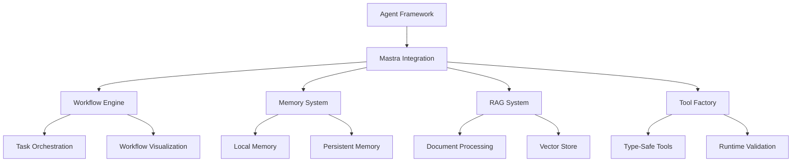
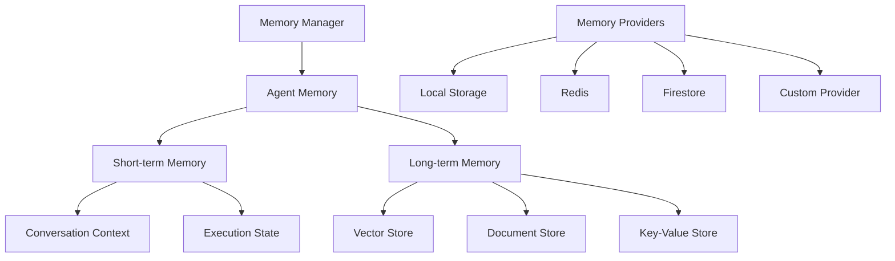
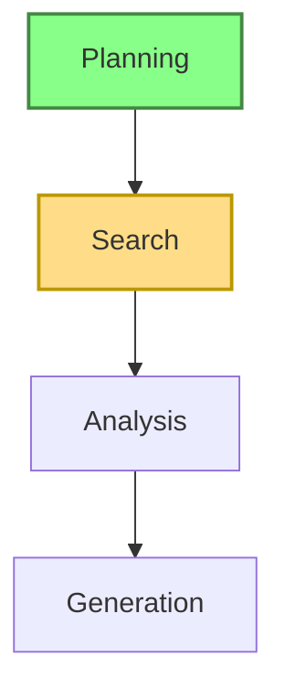
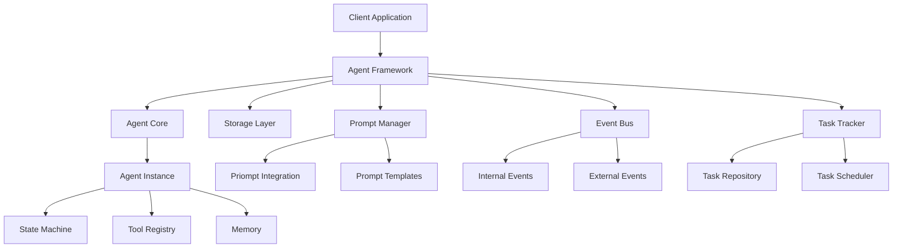

URL Source: https://ryolu.notion.site/how-to-make-something-great

Markdown Content:


How to make something great
---------------------------

Listen as a podcast • [閱讀中文版](https://ryolu.notion.site/1610a94b9c108079a95be4362afd4a26?pvs=25)

In the pantheon of creative endeavors—be it product design, art, architecture, software, or some hybrid creature of the mind—true greatness emerges not from any single stroke of genius, but from a careful cultivation of potential. There’s a quiet, almost mystical art to starting with something so unrefined that you’re unsure if it’s mud or marble, and patiently revealing its shape until others recognize its beauty. In the end, they’ll say: “Of course! It’s so obvious.” But what they see is only the final state. What you know is the hidden complexity—how the stone could have cracked and fallen to rubble at any misstep.

A truly fertile concept often resists immediate clarity. It’s a rough form: a half-lit corridor where you see only silhouettes and faint hints of what could be. Resist the urge to force early perfection. Instead, feel its potential: a spaciousness that can accommodate many problems at once, each waiting to be resolved into an elegant pattern. The best future solutions seem almost retroactively inevitable. In the final analysis, greatness often appears so natural that it’s hard to imagine any other way. The philosopher who said that “the truth is what never had to be said” might as well have been talking about a product so perfectly aligned with its context that no competitor can propose a simpler alternative.

One of the strangest illusions of our time is the fetishization of role and title over skill and mindset. As if the name of a position could summon forth the muse of creativity. The team that molds greatness is not a conscript army but a band of pilgrims—each invested, curious, and eager to shoulder challenges. Such people don’t hide behind process or hierarchy. They meet problems nakedly, exchanging frank insights and critiques, driven by a shared sense of higher purpose. Those who only pretend, who cling to a resume or leverage half-hearted interest, may fill a room but will starve the mind. Such individuals dilute ambition, adding friction instead of fuel. Seek those who care deeply and are excited to shape something larger than themselves.

We’re taught to focus early—choose what’s “important,” discard what’s peripheral. But at the genesis of a thing that might be great, strict focus is a ruse. The best solutions emerge after you’ve wandered through a landscape of problems, discovering hidden connections and rich intersections. Don’t erect premature fences around what the solution “should” be. Early constraints, imposed for neatness or efficiency, choke off the possibility of the truly sublime. The treasure lies in expansive searching, in stitching together a tapestry of interrelated issues. Later, once you’ve roamed far enough, clarity will guide you toward the right edges. Until then, let curiosity roam.

Many yearn for neat narratives, perfect prototypes, or bulletproof decks that placate stakeholders. But in this quest for tidy consensus, the work can stagnate, spinning its gears in the muck of groupthink and subtle fear. Forward progress is made when you trust the raw feeling that something is worth trying and then try it. You don’t need permission from every corner. Build, code, draw, revise, scrap, and build again. These acts aren’t wasted effort; they are sketches on a canvas that teach you what’s real and what’s fantasy. Don’t revere planning over doing. Craft’s truth emerges only through the friction of material engagement.

In a world saturated with A/B tests, focus groups, and the fetishization of “data-driven” everything, it’s easy to strangle a young idea in the crib. If you rush to validate too soon—before the idea has a coherent form, before you’ve given it the time and space to grow—you merely confirm that the infant cannot run a marathon. Of course it can’t. Greatness isn’t summoned by a hasty thumbs-up or thumbs-down. Instead, internalize the doubts as signals that more exploration is needed. Refine the concept, enrich it, feed it new inputs. Later, once it stands on its own feet, the world can judge its stride. But kill it too early, and you destroy something that never had a chance to prove itself.

The myth says you must choose: move quickly and break things, or move slowly and ensure elegance. But genuine excellence emerges from a dance between speed and depth, agility and quality. Like a skilled musician who can improvise yet still maintain impeccable technique, you must learn to adapt fluidly without compromising the integrity of the final piece. Break down the solution into layers that can be integrated over time, each piece holding meaning and value. A thin, final sliver alone might appear trivial, but when layered together, these increments form a whole tapestry that leaves no doubt of its worth. Don’t be seduced by the fantasy of “done” too early. The partial solution is an invitation to continue building until a harmonious vision emerges.

In the end, greatness is less a checklist than a delicate alignment of mindsets, methods, and morals. You begin with something half-seen and half-known, build with others who share your faith, wander widely before settling on a direction, learn by doing rather than by empty theorizing, protect nascent ideas from premature judgment, and persist with agility, refusing to sacrifice excellence on the altar of speed. Each of these principles, taken alone, is just a note. Together, they form a chord whose resonance can reshape the world.

Reflecting on these points, you might say the process feels messy and unpredictable. Indeed, it should. The birth of something great is never serene. It’s a series of cracks and contortions in the rock, each break revealing a new gleam beneath the surface. Over time, what was once ambiguous becomes inevitable—what was once a mad experiment looks, in hindsight, like a foregone conclusion. The gift of great creation is that, when done right, it looks both astonishingly fresh and deceptively familiar. It’s not that you invented some impossible thing; it’s that you revealed what we all secretly suspected could be done, and in so doing, gave it form.

# Official Glossary: Cutting-Edge AI-Native Vercel Applications (2024)

This curated glossary details the toolkit, frameworks, AI libraries, databases, infrastructure, and inspirations ideal for building cutting-edge AI-native (Web4) applications leveraging Next.js, React, Vercel, Neon, Upstash, and advanced web paradigms.

---

## 🚀 **Main Framework & Platform**

- **[Vercel](https://vercel.com)**  
  Serverless platform optimized explicitly for Next.js apps, supporting edge rendering, KV storage, vector databases, and AI-native workflow integration.

- **[Next.js v15](https://nextjs.org/docs)**  
  React framework ensuring robust server components, server actions, parallel routes, and edge-native execution for AI-heavy workloads.

- **[React 19](https://react.dev/)**  
  Major update emphasizing concurrent rendering, efficient hydration strategies, and automated data fetching improvements aligned with AI workflows.

- **[Tailwind CSS v4](https://tailwindcss.com/docs/installation)**  
  Utility-first CSS for rapid, sensible, and minimalistic UI creation.

---

## 📚 **UI & UX Tooling**

- **[shadcn/ui](https://ui.shadcn.com/)**  
  A customizable component library built on Radix UI and Tailwind CSS.

- **[Radix UI](https://radix-ui.com)**  
  Accessible, unstyled UI primitives tailored for building minimalist yet robust interfaces.

- **[Phosphor Icons Duotone](https://phosphoricons.com)**  
  Modern icon set ideal for monochromatic, high-contrast minimalistic design languages.

---

## 🛢️ **Database & Storage**

- **[Neon](https://neon.tech/docs)**  
  Serverless PostgreSQL database optimized for Vercel Edge Functions, including built-in support for edge-friendly database querying ([neondatabase/neon-vercel-kysely](https://github.com/neondatabase/neon-vercel-kysely), [neondatabase/neon-vercel-rawsql](https://github.com/neondatabase/neon-vercel-rawsql)).

- **[Upstash](https://upstash.com/docs)**  
  Serverless Redis platform providing KV (Key-Value) and Vector storage, essential for AI application persistence, embeddings, semantic search, and user sessions ([upstash/jstack](https://github.com/upstash/jstack)).

- **[Vercel Blob](https://vercel.com/blog/vercel-storage)** *(currently in Private Beta)*  
  Built-in file storage solution for media, content uploads, and static asset hosting within the Vercel ecosystem.

---

## ⚙️ **Data & API Management**

- **[Prisma](https://www.prisma.io/docs)**  
  Type-safe ORM simplifying data access layer, smoothly interoperable with Neon.

- **[tRPC](https://trpc.io/docs)**  
  Provides end-to-end type safety for building APIs paired seamlessly with Prisma and Zod.

- **[SWR](https://swr.vercel.app)**  
  React Hooks-based data fetching layer offering automatic caching, real-time updates, and dynamic loading states.

- **[Kysely](https://github.com/koskimas/kysely)** *(optional advanced usage)*  
  Type-safe SQL query builder designed for efficient edge-native Neon DB interactions ([neondatabase/neon-vercel-kysely](https://github.com/neondatabase/neon-vercel-kysely)).

---

## ✅ **Validation, Authentication, and Security**

- **[Zod](https://zod.dev)**  
  Robust schema validation and parsing library providing comprehensive TypeScript support.

- **[Auth.js (NextAuth)](https://authjs.dev)**  
  Secure, scalable authentication solution designed for Next.js serverless architectures.

- **Passkeys** *(future-leaning consideration)*  
  Modern, passwordless authentication using device-bound passkeys. Ideal for fully leveraging secure, user-friendly web authentication experiences.

---

## 🧪 **Testing & Mocking**

- **[MSW (Mock Service Worker)](https://mswjs.io)**  
  Seamless API mocking, streamlining rapid frontend development even before real backend services are finalized.

---

## 💡 **AI & Agentic Frameworks**

- **[Mastra](https://mastra.ai)**  
  AI-native framework built for complex, agent-driven workflows and conversational interfaces, enabling sophisticated intelligent user experiences.

- **[Priompt](https://priompt.dev)**  
  Innovative prompt engineering toolkit designed for optimizing prompts, reducing AI model latency, and managing complex prompting scenarios.

---

## 🎯 **State Management & Animations**

- **[Zustand](https://github.com/pmndrs/zustand)**  
  Lightweight global store architecture optimized for React state management.

- **[Jotai](https://jotai.org/docs/introduction)**  
  Atomic state management, enabling fine-grained, performant reactivity and composable state primitives.

- **[Framer Motion](https://framer.com/motion)**  
  Advanced UI animation library shaping silky smooth, generative web interactions.

- **[Auto-Animate](https://auto-animate.formkit.com/)**  
  Easy-to-integrate automatic animations responding intuitively to UI state transitions.

---

## 🔐 **Edge Infrastructure & Environment Management**

- **[Vercel Edge Functions](https://vercel.com/docs/functions/edge-functions)**  
  Globally distributed runtime for lightning-fast backend execution, well-integrated with Neon DB and Upstash KV/Vector stores.

- **Environment Management**  
  Leveraging native Vercel CLI for managing (`DATABASE_URL` and other sensitive variables) simplifies local and production environment configuration ([neondatabase/neon-vercel-rawsql](https://github.com/neondatabase/neon-vercel-rawsql)).

---

## 🎨 **Design Ethos & Principles**

| Principle            | Description                                           | Tech                          |
|----------------------|-------------------------------------------------------|-------------------------------|
| **Minimalism**       | Embracing simplicity, clarity, and removing noise.    | Tailwind CSS, Radix UI        |
| **Utilitarianism**   | Interface and interactions justified by clear utility.| shadcn/ui, Zustand, Jotai     |
| **Typography**       | Left-aligned, monospace font with web2 clarity.       | [Iosevka](https://typeof.net/Iosevka/) |
| **Color Scheme**     | Monochromatic, high-contrast, neu-minimalist visuals. | Tailwind CSS Palette          |
| **Interaction**      | Subtle, clear animations aid usability at transitions.| Framer Motion, Auto-Animate   |

---

## 🌟 **Inspirational References**

- [Vercel v0](https://vercel.com/design) — Minimal yet expressive UI clarity.
- [Linear](https://linear.app) — Streamlined productivity-first experiences.
- [Arc Browser](https://arc.net) — Clean UI combined with delightful AI interactions.
- [Rabbit R1](https://rabbit.tech/r1) — Functional yet emotionally minimal tech interfaces.
- [Teenage Engineering](https://teenage.engineering) — Hardware minimalism for digital metaphors.

---

## Further Reading & Resources (New Additions)

- [Passkeys Authentication Demo](https://github.com/nealfennimore/passkeys) – Advanced passwordless auth approach with Cloudflare Workers, KV storage, and D1 databases.
- [jStack](https://github.com/upstash/jstack) – Opinionated Next.js dev stack emphasizing low-cost serverless apps inspired by T3 Stack—excellent guidance for integrating Upstash with Next.js.
- [Neon Edge Integration Patterns](https://github.com/neondatabase/neon-vercel-kysely) – Production patterns for Neon DB integration with Vercel Edge Functions.

---

This refined and carefully expanded glossary represents the current state-of-the-art in building performant, secure, minimalistic, AI-native Vercel & Next.js applications, providing actionable guidance, officially linked docs, and inspirational benchmarks for developing exceptional web4 experiences.

//

inspiration:

This file is a merged representation of the entire codebase, combining all repository files into a single document.
Generated by Repomix on: 2025-03-06T08:43:34.013Z

================================================================
File Summary
================================================================

Purpose:
--------
This file contains a packed representation of the entire repository's contents.
It is designed to be easily consumable by AI systems for analysis, code review,
or other automated processes.

File Format:
------------
The content is organized as follows:
1. This summary section
2. Repository information
3. Directory structure
4. Multiple file entries, each consisting of:
  a. A separator line (================)
  b. The file path (File: path/to/file)
  c. Another separator line
  d. The full contents of the file
  e. A blank line

Usage Guidelines:
-----------------
- This file should be treated as read-only. Any changes should be made to the
  original repository files, not this packed version.
- When processing this file, use the file path to distinguish
  between different files in the repository.
- Be aware that this file may contain sensitive information. Handle it with
  the same level of security as you would the original repository.

Notes:
------
- Some files may have been excluded based on .gitignore rules and Repomix's
  configuration.
- Binary files are not included in this packed representation. Please refer to
  the Repository Structure section for a complete list of file paths, including
  binary files.

Additional Info:
----------------

================================================================
Directory Structure
================================================================
inspiration/
  addressable-ai-agents.md
  event-bus.md
  full-stack-ai-agents.md
  local-first-ai-agents.md
  prompt-design-arvid.md
  reliable-ux-durable-obj.md
  task-tracking.md
memory/
  bank_00.md
  bank_10.md
  bank_11.md
tools/
  mastra/
    index.md
    memory.md
    workflow.md
  priompt/
    index.md
    usage.md
architecture.md
core-components.md
example-implementation.md
integration-guide.md

================================================================
Files
================================================================

================
File: inspiration/addressable-ai-agents.md
================
Title: call me maybe

URL Source: https://sunilpai.dev/posts/addressable-ai-agents/

Published Time: 2025-02-10T00:00:00.000Z

Markdown Content:
10 February 2025

AI agents should be addressable

(thanks to ashley peacock ([github](https://github.com/apeacock1991)/[twitter](https://x.com/_ashleypeacock)) for inspiring me to write this. he built [an ai agent to manage customer service simultaneously with email/chat](https://x.com/_ashleypeacock/status/1886855862670782552) that got me thinking about this. follow him, [buy his book](https://pragprog.com/titles/apapps/serverless-apps-on-cloudflare/))

we’ve already touched around this in different ways with [full stack ai agents](https://sunilpai.dev/posts/full-stack-ai-agents), the ability to [assign tasks](https://sunilpai.dev/posts/ai-agents-need-tracking/), which all imply that ai agents should be addressable in some way; some way to “talk to them”, identify them. concretely, this means that an ai agent should have a URL, and an email address (and a phone number?), maybe more.

building agents on durable objects already mean they’re addressable inside a Worker with a DO namespace + id, but we can go further and make them addressable from the outside. let’s generalize ashley’s example. we make a helper function that wraps the root worker to intercept http requests/websockets, and email. If a new email comes in to [help@domain.com](mailto:help@domain.com), we route it to a new agent. you can also email the agent directly. you can also visit /agents/:id to interact with the agent with a chat interface. inside the agent, we can tell whether a user is currently connected to a websocket or not(via the ui), and we use that to decided whether to respond via UI or via email. (tell me, what else could we do with this?)

```
class Agent extends Server<Env> {
  constructor(ctx, env) {
    super(ctx, env);
    // let's setup a table to store messages
    // wherever they come from
    this.ctx.storage.sql.exec(`CREATE TABLE IF NOT EXISTS messages (
    id INTEGER PRIMARY KEY AUTOINCREMENT,
    data TEXT,
    source TEXT CHECK(source IN ('email', 'http', 'websocket')),
    created_at DATETIME DEFAULT CURRENT_TIMESTAMP)`);
  }
  step(data: string, source: string): string {
    this.ctx.blockConcurrencyWhile(async () => {
      this.ctx.storage.sql.exec(`INSERT INTO logs (data, source) VALUES (?, ?)`, data, source);
      // run an LLM step to reply
      return "this would be a reply based on everything in logs";
    });
  }

  onMessage(connection, message) {
    const reply = this.step(message, "websocket");
    connection.send(reply);
  }
  onEmail(email: Email) {
    const reply = this.step(email.body, "email");
    email.reply(reply);
  }

  onRequest(request: Request) {
    const reply = this.step(request.body, "http");
    return new Response(reply);
  }
}
type Env = {
  agents: DurableObjectNamespace<Agent>;
};

function routeAgents<Env>(handler: ExportedHandler<Env>): ExportedHandler<Env> {
  return {
    async fetch(request, env, ctx) {
      const { pathname } = new URL(request.url);
      let match;
      if (/\/agents\/[a-zA-Z0-9_-]+/.test(pathname)) {
        match = pathname.match(/\/agents\/([a-zA-Z0-9_-]+)/);
        if (match) {
          const agentId = match[1];
          const agent = env.agents.get(agentId);
          // forward websockets and requests to the agent
          return await agent.fetch(request);
        }
      }
    },
    email: async (email, env, ctx) => {
      let agentId: string;
      let match;
      if (email.to === "hello@domain.com") {
        agentId = `agent-${Math.random().toString(36).substring(2, 15)}`;
      } else if (email.to.match(/^agent\//)) {
        match = email.to.match(/^agent\-([a-zA-Z0-9_-]+)/);
        if (match) {
          agentId = match[1];
        } else {
          // route to default
          agentId = "default";
        }
      }
      // route emails to the agent
      const agent = env.agents.get(agentId);
      return await agent.onEmail(email);
    },
    queue(batch: messages) {
      // ...
    },
  };
}

// now we can do this:

export default routeAgents({
  fetch: async (request, env, ctx) => {
    // any requests that reach here aren't for agents
    return new Response("hello from the root worker");
  },
});
```

the code is quite straightforward since we have a single thread for a durable object. I would use partysync to simplify websockets and ui boilerplate, of course. (should probably also get an email helper like the above into the partyserver family of libraries soon.)

with this code, we now have a way to route emails to agents, and a way to route websocket connections to agents. we can also visit /agents/:id to interact with the agent with a chat interface (implementing that is left as an exercise to the reader).

not a groundbreaking idea, but certainly a useful one. it also starts giving shape to another idea, which is that “agents” might not actually have much to do with LLMs after all, they’re just containers for execution, that you stuff with capabilities, observability, and a rube goldberg machine that does things. feels like a good mental model to keep in mind.


(twitter: [https://x.com/threepointone/status/1888763110200115368](https://x.com/threepointone/status/1888763110200115368))

================
File: inspiration/event-bus.md
================
Title: an event bus for ai agents

URL Source: https://sunilpai.dev/posts/an-event-bus-for-ai-agents/

Published Time: 2025-02-27T00:00:00.000Z

Markdown Content:
27 February 2025

it is very professional yes

*   agents can expose http/ws hooks, email hooks, or arbitrary function calls
*   agents can be triggered by http/ws, email, or… (?)

every automation system has some form of an “event bus”, whether explicit/implicit. it lets us use vocabulary like “when a new user signs up, send them an email”. the naive way of implementing this is to add the email sending logic in the http handler where a user signs up. but the professional way is to push an event on to a queue, and to have a something (usually a workflow) consume that queue event and send that email. this gives us retries, decoupling, all the good things queues give you. you might see where I’m going with this:

```
class MyAgent extends Agent {
  onUserSignup() {
    // ... let the robot brain decide what to do next
  }
}

export default {
  async queue() {
    for (const message of batch.messages) {
      if (message.type === "user.signup") {
        (await getAgentByName(env.MyAgent, message.email)).onUserSignup(message);
      }
    }
  },
};
```


so instead of passing the event explicitly/deterministically on to a workflow, let an agent intercept it and “decide” what to do next. is the user currently connected to the agent chat? then ping them right there. maybe schedule some action to happen later (in 7 days, send an email if they haven’t made a project yet). etc etc.

standard automation queues might be too noisy here (though probably worth a first implementation) but I suspect there will be a subset of (enriched) events that get passed on to another queue only for consumption by agents.

and of course, the agents could push events back on to the bus…

================
File: inspiration/full-stack-ai-agents.md
================
Title: Full Stack AI Agents

URL Source: https://sunilpai.dev/posts/full-stack-ai-agents/

Published Time: 2025-02-02T00:00:00.000Z

Markdown Content:


what if you gained root access into an agent’s brain? what would it look like?


ai agents are little long running processes that are “doing stuff” in the background. business processes, personal automation, chatbots, workflows, etc. durable objects are a fantastic fit as containers for these agents. (here’s a video where I talk about running the anthropic agent patterns inside durable objects [https://x.com/threepointone/status/1884783568603246802](https://x.com/threepointone/status/1884783568603246802), longform post coming soon). now sure, we can build an application ui for the experience. but… how do we look _inside_ what the agent is doing? we could log metrics and events, and stream them somewhere, but this thing is a living-ish thing. like any other workflow/automation, we sure would like to to be able peer INSIDE these agents to see what’s happening.

i.e., not only do agents have input/output/state, they also should have a ui! call it root, an admin panel, a dashboard, whatever. conceptually, every Agent should have a `render()` method that lets your root around its innards, see what’s happening, and even modify the agent’s state.

(right?! right?!)


Here’s an example; let’s say we have a (multiplayer) chat interface. We have a durable object `ChatRoom` for each chat session, that clients connect to. A simple method of adding “ai” to this chat would be to add a handler inside this chat durable object that responds to every message with an ai generated response (indeed, that’s what the official template recommends, and it works well.) for the sake of this example, tho, let’s make it a bit more interesting. we’ll make an `Agent` that connects to the chat, that can see and respond to the messages, but also has its own ai-specific `render()` method.

```
// pseudo code

class ChatRoom extends DurableObject {
  onMessage(message: string) {
    this.broadcast(message); // this will send the message to all connected clients
  }

  render() {
    return (
      <div>
        <h1>Chat Room</h1>
        <Chat />
      </div>
    );
  }
}

class Agent extends DurableObject {
  constructor() {
    // connect to the chat room
    this.connect(Room.get("some-room-name"), {
      onMessage: (message: string) => {
        // do something with the message
        // like reply, analyze, do tool calls, etc
      },
    });
  }

  render() {
    if (!this.isAdmin()) return null;
    return (
      <div>
        <h1>Chat Agent control panel</h1>
        {/* a bunch of buttons to do stuff inside the agent */}
        <Actions />
        {/* a log of everything that's happened inside the agent */}
        <Logs />
      </div>
    );
  }
}
```

We then setup urls so that everything on `/chat/:id` will be handled by the `ChatRoom` durable object, rendering a chat ui as expected. but we’d also like to have a `/agent/:id` url, that will be handled by the `Agent` durable object. (You’d probably also setup some auth so that only admin users can access the agent. whatever works for you, a discussion for later.)


“hidden” from the rest of the app, the agent now has its own state/persistence, and we can implement functionality that’s unique to it. in this example, let’s use a reasoning model to generate a response. we’ll hide the actual “reasoning” output from the chat room, and only send the final response. further, we can now add a ui to the agent, and have it render itself. we’ll implement this agent with partysync as well, so that a browser can connect to it and see the agent’s state/ui.


with this setup, every agent now becomes a proper server, a full stack web app, with its own ui. there’s nothing stopping us from building fully interactive apps that could modify the agent, send it input/output, etc. a whole new world opens up. you could “login” to an agent, and temporarily give it a new persona, or even a new model. maybe share credit card details while it’s trying to make a transaction, and then delete the data to make it “forget” it. change it’s prompt midway. perhaps even give it a new model.

Now, let’s talk about how we can build this. First, a sidequest about some recent developments that make this possible.

[vite](https://vite.dev/) is a dev/build tool that is super popular in the javascript ecosystem. it started out as a tool for building plain frontend apps, but now works for server side code, etc. it’s pretty great. it’s particularly nice when building both frontend and backend together, in the same project (so called “full stack apps”).

of note, everyone loves the developer experience of `vite dev` - it’s really fast, there’s an amzing ecosystem of plugins, which you can mix and match for your own stack. some folks might know I’ve [been vite-pilled for a while now](https://sunilpai.dev/posts/esbuild-with-jason/) (we were so young…), so I’m not even parroting the narrative; I _set_ the damn narrative you common folks consume. I would never shill a product simply because I’m employed by them, or have any financial incentive to make people use it.

ahem. anyway.

cloudflare workers is the world’s best platform for running your javascript. the key thing is a custom javscript runtime [workerd](https://github.com/cloudflare/workerd) (built on v8) that is optimized for serverless environments; which gives it magic powers like zero start up time (and it’s [super clever how that works](https://blog.cloudflare.com/eliminating-cold-starts-with-cloudflare-workers/)), running on a planetary netowkr in hundreds of cities and thousands of points of presence. this custom runtime has unique apis (that are inspired by standards) that make it a joy to work with; in addition to stuff like `fetch`, `Request`, `Response`, `WebSocket`, `caches`, etc, it has [durable objects](https://developers.cloudflare.com/durable-objects/what-are-durable-objects/), which is the actor model, but for javascript. (I have written about durable objects before: [1](https://sunilpai.dev/posts/the-future-of-serverless/), [2](https://sunilpai.dev/posts/spatial-compute/), [3](https://sunilpai.dev/posts/durable-objects-are-computers/))

the local dev experience is powered by [wrangler](https://github.com/cloudflare/wrangler), which is a cli tool for working with cloudflare workers. among other things, it handles all the boring stuff like compiling your code and dependencies, and running it inside workerd.

`vite dev` is vite’s story for local development. it handles all the boring stuff like compiling your code and dependencies… but then for server side code, it uses node. DAMMIT. sure, node now supports standards APIs like `fetch`, `Request`, `Response`, etc, but I can’t run workerd-specific stuff durable objects in it. there are workarounds, but they’re not ideal. you’d have to build your frontend application with vite dev, and run wrangler in parallel for the backend, it was all very fidgety and not satisfying.

vite 6 fixes that specific problem. tl;dr - [with the new environment api](https://vite.dev/blog/announcing-vite6#experimental-environment-api), you can now run your code inside _any_ custom runtime.

peeps inside cloudflare have been furiously working then on making `vite dev` work with workers. to have a great integrated experience when building an app that targets browser sand workers (and maybe even others? like node, react-native, deno, etc) at the same time. [they just started shipping 0.0.x versions of the plugin](https://npmjs.com/package/@cloudflare/vite-plugin), which means it’s time to start playing with it!

(the big caveat here is that existing frameworks still have to change code to support this. that’s a process that’s underway, but it’s only a matter of time before it’s done.)

building this without as two separate apps would’ve been a complete fucking pain in the ass. it would’ve been doable, but the amount of back and forth and operational complexity… just thinking about it would’ve been a nightmare. but now I can build this whole app as a single concept, with great dx to just ship when I’m done.

so… that’s the thing. full stack ai agents. does your ai agent have a ui, anon?

(video: [https://x.com/threepointone/status/1886214582253089179](https://x.com/threepointone/status/1886214582253089179))

================
File: inspiration/local-first-ai-agents.md
================
Title: ai agents are local first clients

URL Source: https://sunilpai.dev/posts/local-first-ai-agents/

Published Time: 2025-02-16T00:00:00.000Z

Markdown Content:
(did sunil really make a title with TWO hyped up topics? yes he did.)

first, the punchline.


let’s start with a mental model of how you would build an app. conceptually, it’s a machine with configuration, state, and “methods”/ functions that you can call on them with arguments to affect change. we might represent it in code like this:

```
// let's say we're building a todo app
const app = {
  config: {
    darkMode: false,
    language: "en",
  },
  state: {
    todos: [],
    input: "",
  },
  methods: {
    toggleDarkMode: () => {
      app.config.darkMode = !app.config.darkMode;
    },
    addTodo: (todo: string) => {
      app.state.todos.push({
        id: crypto.randomUUID(),
        title: todo,
        completed: false,
      });
      app.state.input = "";
    },
    removeTodo: (index: number) => {
      app.state.todos.splice(index, 1);
    },
    // ...
  },
};
```

with a machine like this, we can build a ui for the todo app. it might look like this in react:

```
function TodoApp() {
  return (
    <div>
      <input value={app.state.input} onChange={(e) => app.methods.setInput(e.target.value)} />
      <button onClick={() => app.methods.addTodo(app.state.input)}>Add Todo</button>
      {app.state.todos.map((todo) => (
        <div key={todo.id}>
          <input
            type="checkbox"
            checked={todo.completed}
            onChange={() => app.methods.toggleTodo(todo.id)}
          />
          <span>{todo.title}</span>
          <button onClick={() => app.methods.removeTodo(todo.id)}>Remove</button>
        </div>
      ))}
      <button onClick={() => app.methods.toggleDarkMode()}>
        {app.config.darkMode ? "Light Mode" : "Dark Mode"}
      </button>
    </div>
  );
}
```

nice. now of course, this has to actually persist to a server/database somewhere. so we’d do somthing like this in our methods:

```
methods: {
  // ...
  saveTodos: async () => {
    await fetch("/api/todos", {
      method: "POST",
      body: JSON.stringify(app.state.todos),
    });
  },
};
```

and we’d await it in our addTodo method:

```
addTodo: async (todo: string) => {
  app.state.todos.push({
    id: crypto.randomUUID(),
    title: todo,
    completed: false,
  });
  await app.methods.saveTodos();
};
```

cool. we now have a todo app that persists to a server.

(now the nerds in the audience are probably pissed because this doesn’t wire up to a react rerender, and might show view tearing, and we’re not using any state management library, whatever. don’t care, this post isn’t about those specifics, it’s about the mental model. get bent losers.)

in a real app, you’d use a state management library that formalises this relationship between state, ui, and methods. (e.g. redux has “actions” and “reducers” for this that act on a “store” of state, and rerender on every state change.)

on the server side, you’d mirror this structure. it might look like this:

```
const server = {
  state: {
    todos: [],
  },
  methods: {
    getInitialState: async () => {
      const todos = await sql.query("SELECT * FROM todos");
      return { todos };
    },
    addTodo: async (todo: string) => {
      await sql.query("INSERT INTO todos (title) VALUES (?)", todo);
    },
    // ...
  },
};
```

this gives an architecture that gives us “separation of concerns” - the ui acts as “client” and the server acts as a, er, “server”. the server only cares about the data and some “business logic”, independent of the clients/uis that will be built to interact with them. importantly, the server provides apis to 1. gather context about the system being manipulated, 2. perform actions on the system.

a lot of this is boilerplate, and has led to the rise of “local first” systems in building UIs. these systems usually have a “sync engine” that handles syncing most/state state between the client and ther server, and the client then performs “actions”/“mutators” that 1. optimistically updates the state/ui on the client 2. sends the action to the server where it gets executed (with any other database updates/side effects), and then 3. confirms and commits the action on the client side. it’s like git, but for uis. very demure, very mindful. of note, they leverage persistence systems on the browser side (via indexxeddb, or localstorage, or file system apis) to persist state, so they don’t have to fetch the entire server side state on restarts etc. particularly great for highly interactive apps.

I recommend going to [this site](https://localfirstweb.dev/) to learn more, see what different flavours exist, and get a sense of the ecosystem. there’s also a great post on sync engines by [Adam Nyberg](https://x.com/Adam_Nyberg): [https://adamnyberg.se/blog/2025-02-11-real-time-sync-engines/](https://adamnyberg.se/blog/2025-02-11-real-time-sync-engines/) that includes this neat diagram:


anyway. ai agents. these are processes that act on a “state” and “methods” of a “machine”. they connect to data sources and perform actions on the machine. they use the context of the machine to make decisions. and users (us) can interact with them. they benefit from fast startup time, and usually have access to their own internal persistence system to maintain that context over long periods of time.

sounds very similar to a ui/browser/client, right?

in this very nascent period of growth for ai agents, they’re being built as stateless systems, just like browser apps were built before sync engines were a thing; workflows initialise and grab a whole bunch of state and context from disparate systems, and explcitly call async apis that affect change, and then discard it all after a “goal” is reached. this isn’t ideal, agents are meant to long running processes that can “sleep”/pause and resume, and they’re meant to be able to act on long term context.

I contend that ai agents should be built exactly like local first apps/clients. every agent should be able to connect to a “server” that provides the context of the system, sync that state over to it’s own persistence system, and perform actions on the system. while this has the immediate benefit of reducing boilerplate while building agents, it also means that the entire system (a browser client app, the mobile app, the ai agents) can be iterated on and deployed without worrying about api drift and inconsistency. and (brace yourself for some shilling) this means that your ai agent infrastructure should probably be stateful (_cough_ durable objects _cough_).

I explored this in the [full stack ai agents](https://sunilpai.dev/posts/full-stack-ai-agents/) post. the ai agent durable object connects to the chat server durable object, and slurps down the state of the chat room, and then uses that to performa analysis on the chat history. this is built on my (wip) sync engine [partysync](https://github.com/threepointone/partyserver/tree/main/packages/partysync) (I should push up the code that syncs across DOs soon.)

so, that’s the pitch. if you’re building a local first system, I highly encourage you to consider making sure they’re “isomorphic” so that they can run in a browser, mobile app, or ai agent. (yes I just added a third hype word to this!) and use a platform that [makes this part easy, so you can focus on the business logic](https://x.com/threepointone/status/1889661957520736622).

find me on twitter and let’s talk about this post. [https://x.com/threepointone/status/1891199382428557459](https://x.com/threepointone/status/1891199382428557459)

================
File: inspiration/prompt-design-arvid.md
================
Title: Prompt Design

URL Source: https://arvid.xyz/posts/prompt-design/

Published Time: 2023-06-11 13:42:16 -0800 -0800

Markdown Content:
I’m usually averse to the common habit of trying to find old-world analogues to new-world phenomena. So please bear with me as I commit that exact sin: **let me present the case for why prompting should be called _prompt design_ and be likened to web design.**

I view prompting as communicating with a time-constrained human. While LLM-specific techniques are certainly helpful (most notably chain-of-thought), I’ve found that one of the best ways to improve performance is to just have extremely clear and high-quality instructions, similarly to how clarity and conciseness helps real humans understand better too.

_Prompting-as-clear-communication_ makes prompting sound like writing. Most of the prompting I am doing, however, is parametric: I have a number of input variables, and need to dynamically adapt my prompt to those.

Hence, _prompting-as-clear-communication-with-dynamic-input_ feels like the most accurate characterization.

What other field is about communicating clearly with dynamic input? Web design.

Let’s list out all the similarities. Prompting and web design both:

1.  require clarity, and have communication as the primary goal;
2.  need to respond to dynamic content, unlike writing or magazine layout; and
3.  need to adapt their content to different sizes — screen sizes for web design, context windows for prompting.

In my experience from doing both prompting and web design, I’ve also found that I have similar developer preferences in the two areas:

1.  _Looking at the actual prompt_ is super important, just like _looking at the rendered website_ is super important. I cannot design a website if I have to simulate the HTML and CSS rendering process in my mind. Similarly, it is really hard to write good and clear prompts without looking at the rendered output of a prompt with all input variables filled in.
    *   For example, the prompt `"Hi ${username} ${message}"` may look reasonable, until you render it and realize that the user name blends in with the message.
2.  Composable components are useful in both prompting and web design.
3.  Declarative is better than imperative for both. It is really hard to change a website where all HTML elements are created with `document.createElement` calls. Similarly, reading and changing a prompt that consists of a long sequence of `str += "..."` easily becomes unmanageable.
4.  In both, I sometimes want to achieve “pixel perfection”. When prompting less capable models (GPT-3.5 and worse), I want to make sure that I have no extraneous newlines or other types of imperfect formatting, and when designing a website, sometimes every pixel matters.

For LLM agents, it is possible to take the analogy even further: agent prompting can be seen as building an interactive website for the agents, where they can “click buttons” by calling functions, and where the prompt re-renders in response to a function call, just like a website re-renders in response to a button click.

Of course, there are differences between prompt design and web design:

1.  Prompting deals with text only (for now!).
2.  Caching is different: for agents in particular, you want to make sure that your re-renders are cheap by only changing the later parts of the prompt. There’s a contrived parallel here to the web (you want to cache-optimize your website), but I think it is fundamentally quite a different challenge.

Still, the similarities have convinced me that prompting should be called _prompt design_, not _prompt engineering_. Writing a prompt _feels just like designing a website_, and should thus be named the same way too.

The prompt design perspective inspired me to create [Priompt](https://github.com/anysphere/priompt), a React-like, JSX-based prompt design library.

### Priompt v0.1: a first attempt at a prompt design library

[Priompt](https://github.com/anysphere/priompt) is a first attempt at creating a prompt design library inspired by modern web design principles. We are using it internally at [Anysphere](https://anysphere.co/), and we like it a lot.

I think it is probably not exactly correct in all of its abstractions, but I am at least convinced that JSX is a far more ergonomic way to write prompts than string templates. Even the simple thing of trivially being able to comment out parts of your prompt makes the iteration loop much faster.


What prompting as JSX looks like.

Priompt also comes with a (very hastily put together) preview website, where you can preview your prompt on real data. When developing your application, you can log the serialized `props` coming into a component on every request. Then, when you see unexpected behavior, you can go to the Priompt preview, look at the exact prompt, and change the source code and have the prompt update with the same `props` as the real request. We’ve found that this makes it easier to iterate on prompts.


Previewing prompts.

If you try it out, please let me know your thoughts! I’d love to see more ideas in the same vein, or just be told that I’m completely wrong and prompt design is stupid :).

### Caveats

Models change quickly, and so too do prompting techniques have to. With that, I think there are a few caveats with the _prompt design_ characterization:

1.  Pixel-perfect designs are unimportant for GPT-4, and will probably be obsolete for GPT-4.5 or better models.
2.  The context window constraint may disappear, if one extrapolates the recent trend of long-context models. I am not convinced of this, though.
3.  OpenAI appears to be moving in the direction of offering less and less control over the prompt to developers; it is possible that in a year there will be no such thing as a prompt, with the API call just asking us for the raw inputs plus an instruction. This trend of less control started with the chat format and has continued with the recently announced function calling.
4.  It’s possible that caching is one of the most important aspects of prompting, in which case it starts sounding a bit more like engineering than design.
5.  Perhaps prompt design is too low-level, and should be left to a higher-level framework or compiler (e.g. [langchain](https://github.com/hwchase17/langchain)). I think this may be true, but given the quickly changing nature of the LLMs, I personally prefer to be as close to the raw model as possible.

================
File: inspiration/reliable-ux-durable-obj.md
================
Title: Reliable UX for AI chat with Durable Objects

URL Source: https://sunilpai.dev/posts/reliable-ux-for-ai-chat-with-durable-objects/

Published Time: 2025-01-27T00:00:00.000Z

Markdown Content:
tl;dr - one durable object per chat room, websocket connection to it, and you’re done. no more disconnects or weird architectures.

Folks typically build ai chat systems with serverless offerings from providers (like aws lambda and cloudflare workers). They’re architected as normal request-response systems, with a backing database somewhere. While they “work”, they’re not ideal for a number of reasons:

*   because they try to stick to a request-response model; it means subsequent messages are blocked until the previous one is finished. This is particularly annoying when the streaming response is long, and you have a bunch of messages you want to send anyway.


*   maybe you then try to implement a queuing system in yet another service, making your architecture even more complex, and you have to twist and turn your code to make it work.

*   all these serverless things use some form of streaming responses, directly proxied to the LLM provider; this means if you’re in the middle of a long response, and you get disconnected/refresh your browser, you lose your place. this is particularly bad with the rise of reasoning models like openai’s o1, deepseek’s r1, all those. with timeouts and all, the stream breaks eventually even if you’re not disconnected.


*   ok so you decide to use your database as the source of truth, somehow piping the responses to it, and then having your frontend read from the db. maybe your db has a subscription type thing. suddenly you’re having to manage race conditions as well. what you thought would be a weekend optimisation is now a full time job.

*   ever think about why multiplayer ai chat systems are so rare? this is why. not even discounting that websockets for true real time chat aren’t really possible with these serverless offerings. you have to deal with message ordering, a reliable broadcast system, all that. (I’ve spoken about length about how this is now going to be thousands in sunk cost)


honestly I could go on and on. but “serverless” is just a bad fit for realtime/long running/multiplayer systems in general. it’s honestly amazing how far people have come with it at all. just stop faffing around trying to fit a chat sized square peg into a serverless round hole. you can fix all of this today.

durable objects (bad name, amazing tech) solve all of this. literally. durable objects are like tiny javascript vms/containers/computers that you can spin up for an entity, and keep them around for a long time. in this scenario, you’d spin up a durable object for every chat room, and let users (and ai!) connect to it. use websockets to connect to them, and stream messages back and forth. that’s it.


message ordering is guaranteed because it’s just a websocket. you can either hold the entire state of the chat room in memory, and/or use the inbuild database (one per durable object) to store all your messages and stuff. because it’s just syncing state over a websocket, it doesn’t matter whether you reconect/disconnect/refresh your browser. you just get all the state again on reconnection and resume streaming. the actual ai stream will keep piping into your persistence whether or not you’re connected. want to do multiplayer? connect with another websocket, done. no race conditions, your state and compute are running on a single thread in the durable object. want to do server side rendering? first use an http request to render the html from inside the durable object, and then continue streaming when a websocket connects. done. these objects will go to sleep when non one’s connected. and spin back up with zero cold start time when you come back.

stop faffing. use this tech, ship your thing.

*   an entire chat backend build with durable objects/websockets/persistence in 150 loc: [https://github.com/threepointone/durable-chat/blob/main/src/server/index.ts](https://github.com/threepointone/durable-chat/blob/main/src/server/index.ts)
*   durable objects are computers [https://sunilpai.dev/posts/durable-objects-are-computers/](https://sunilpai.dev/posts/durable-objects-are-computers/)
*   the cloudflare stack for ai apps [https://sunilpai.dev/posts/cloudflare-workers-for-ai-agents/](https://sunilpai.dev/posts/cloudflare-workers-for-ai-agents/)

ship today. sleep tomorrow.

================
File: inspiration/task-tracking.md
================
Title: let's talk about a task tracking system for ai agents

URL Source: https://sunilpai.dev/posts/ai-agents-need-tracking/

Published Time: 2025-01-24T00:00:00.000Z

Markdown Content:
24 January 2025

AI agents need tracking software, and we need to build it.

(tl;dr premise: ai agents do tasks. therefore ai agents need a task tracking system. this is probably what a “framework” for ai agents should be.)


think of it as the same vibe you get from tools like jira or linear, but tailored to a bunch of bots that can actually do the work. the real magic is in how it bundles transparency, collaboration, and continuous learning all in one place. first off, you get to see exactly which agent is doing what and why, because every action is logged like a paper trail—no more guesswork about hidden processes. second, you can shift tasks around super easily if an agent gets stuck or if you need a human to intervene, so you don’t lose momentum when you hit an unexpected snag. third, the system creates a sort of knowledge library by storing completed tasks, meaning agents (and humans) can reference past solutions, drastically reducing repetitive labor or duplicating efforts. finally, you can keep an eye on budget constraints like token usage or gpu hours, scaling up or paring down your workforce of agents as needed without ripping your hair out over resource management. so basically, it’s a synergy of human-like pm rigor and ai autonomy, solving a ton of headaches in one tidy package. let’s dig in:

why do we even need this rn?
----------------------------

*   in normal human pm setups, you chop a project into tasks.
*   each task has a success criteria, you track it, then mark it done.
*   we can do the same for ai bc it’s basically just automating that same flow.

core pieces of the puzzle
-------------------------

1.  **supervisor agent**

*   basically the “pm agent” that divides the big objective into smaller tasks, manages them, and keeps an eye on deadlines or goals.

2.  **specialized agents**

*   each agent is good at some niche, so you throw tasks at them that match their skillset. they log all their steps so we can see what’s going on.

3.  **task repo**

*   every completed task gets stored here, with logs and everything. if there’s a future problem that looks similar, guess what? we can rummage through old tasks to see how we solved it.

4.  **budget & resources**

*   if you only have a small budget of tokens, you keep it lean. if you have a big bucket of cpu/gpu time, spin up more agents or let them do deeper research.

step-by-step flow
-----------------

### step 1: define the big idea

someone (maybe a human, maybe an agent) says, “hey, i want to create a new project.” they specify the end goal.

### step 2: break it down

the supervisor agent slices the project into sub-tasks. each sub-task has:

*   a description
*   success criteria
*   dependencies

Main Project Goal (e.g., Build a Website) ↓ Sub Task 1 ↓ Sub Task 2 ↓ Sub Task 3

### step 3: assign tasks

the supervisor agent delegates tasks to whichever specialized agent can handle them (or to a human if needed). tasks get queued by priority or dependencies.

### step 4: do the thing

agents tackle the tasks. each action—function calls, data lookups, etc.—goes into the log. if an agent can’t finish bc it hits some skill/capacity wall, it reassigns or flags it for a human. (this also gives a convenient ui for “human in the loop”)

### step 5: wrap it up

once the success criteria are met, that sub-task is considered done. if a human isn’t happy with the result, they can reopen the task with notes. rinse and repeat.

### step 6: knowledge stash

closed tasks live in a repository. new tasks can rummage through old solutions. honestly, that’s half the point—less re-inventing the wheel each time.

budgeting & resource usage
--------------------------

*   define how many tokens or how much cpu/gpu you can burn.
*   if you’re flush, spin up a ton of agents for deeper exploration.
*   if you’re broke, keep it minimal and run tasks in a more straightforward manner.

observability & logs
--------------------

some folks think monitoring means cpu usage or memory usage. here, we shift to a **task-centric** vantage:

1.  you see real sub-task status updates instead of random system metrics.
2.  you can do classic burn-down charts to see how many tasks are left.
3.  everything’s logged for accountability (or just for debugging).

final thoughts
--------------

this approach merges normal pm logic with ai autonomy. you can keep a handle on progress, plus you get that sweet knowledge repo from past tasks. if you ever want to scale up or pivot fast, you have an infrastructure that’s basically standard pm but for bots.

anyway, that’s the pitch.

================
File: tools/mastra/index.md
================
# Mastra Integration

## Overview

This document outlines how to integrate [Mastra](https://github.com/zackees/mastra) with the agent framework. Mastra is a TypeScript-first AI framework designed for creating complex agent workflows with a focus on explicit APIs and concrete implementations.

## Core Concepts

Mastra provides several key capabilities that complement our agent framework:

1. **Workflow Graph Construction**: Creates explicit, inspectable workflows for agent tasks
2. **Memory Management**: Sophisticated memory systems for maintaining context
3. **RAG Integration**: Built-in support for retrieval-augmented generation
4. **Tool Definition**: Type-safe tool definitions with runtime validation

## Integration Architecture



## Implementation Strategy

Our agent framework will leverage Mastra in the following ways:

1. **For Workflow Orchestration**: Using Mastra's workflow graph to manage complex task sequences
2. **For Memory Management**: Integrating Mastra's memory systems with our agent memory
3. **For RAG Capabilities**: Leveraging Mastra's document processing and retrieval for knowledge-intensive tasks
4. **For Tool Definition**: Using Mastra's type-safe tool definitions

## Integration Examples

### Basic Agent with Mastra Workflow

```typescript
import { createAgent } from '@acme/agent-framework';
import { createWorkflow, createMemory } from 'mastra';

// Create a Mastra workflow
const petAdoptionWorkflow = createWorkflow({
  name: 'PetAdoptionWorkflow',
  description: 'Guides users through pet adoption process',
  steps: [
    {
      id: 'collect_preferences',
      name: 'Collect User Preferences',
      execute: async (context) => {
        // Implementation
      },
    },
    {
      id: 'search_pets',
      name: 'Search Pets',
      execute: async (context) => {
        // Implementation
      },
    },
    {
      id: 'recommend_pets',
      name: 'Recommend Pets',
      execute: async (context) => {
        // Implementation
      },
    },
  ],
});

// Create a Mastra memory
const petAdoptionMemory = createMemory({
  initialState: {
    userPreferences: {},
    foundPets: [],
    selectedPet: null,
  },
});

// Integrate with our agent framework
const petAdoptionAgent = createAgent({
  name: 'PetAdoptionAgent',
  description: 'Helps users find and adopt pets',
  workflow: petAdoptionWorkflow,
  memory: petAdoptionMemory,
  // Our framework components
  tools: [...],
  promptTemplates: {...},
});
```

### Using Mastra for RAG

```typescript
import { createRetriever, createDocumentProcessor } from 'mastra';
import { createAgent } from '@acme/agent-framework';

// Create a document processor
const petDocumentProcessor = createDocumentProcessor({
  chunkSize: 1000,
  chunkOverlap: 200,
});

// Create a retriever
const petRetriever = createRetriever({
  vectorStore: 'pinecone',
  connectionString: process.env.PINECONE_CONNECTION_STRING,
  collectionName: 'pet_knowledge_base',
});

// Create an agent with RAG capabilities
const petExpertAgent = createAgent({
  name: 'PetExpertAgent',
  description: 'Provides expert knowledge about pets',
  tools: [
    {
      name: 'retrievePetInformation',
      description: 'Retrieves information about pets from a knowledge base',
      execute: async (query) => {
        // Process the query
        const processedQuery = await petDocumentProcessor.processQuery(query);
        
        // Retrieve relevant documents
        const documents = await petRetriever.retrieveDocuments(processedQuery);
        
        return { documents };
      },
    },
  ],
});
```

### Type-Safe Tool Definitions

```typescript
import { createTool } from 'mastra';
import { createAgent } from '@acme/agent-framework';

// Define a type-safe tool with Mastra
const searchPetsTool = createTool({
  name: 'searchPets',
  description: 'Search for pets based on user preferences',
  parameters: {
    animalType: {
      type: 'string',
      description: 'Type of animal (dog, cat, etc.)',
    },
    breed: {
      type: 'string',
      description: 'Breed of the animal',
      required: false,
    },
    age: {
      type: 'number',
      description: 'Maximum age in months',
      required: false,
    },
    location: {
      type: 'string',
      description: 'Location for adoption',
      required: false,
    },
  },
  returns: {
    type: 'object',
    properties: {
      pets: {
        type: 'array',
        items: {
          type: 'object',
          properties: {
            id: { type: 'string' },
            name: { type: 'string' },
            breed: { type: 'string' },
            age: { type: 'number' },
            // Other properties
          },
        },
      },
    },
  },
  execute: async (params) => {
    // Implementation
    return { pets: [] };
  },
});

// Use the tool in our agent framework
const petAdoptionAgent = createAgent({
  name: 'PetAdoptionAgent',
  description: 'Helps users find and adopt pets',
  tools: [searchPetsTool],
});
```

## Benefits of Integration

1. **Type Safety**: Mastra provides strong TypeScript typing for all its components
2. **Workflow Visualization**: Mastra workflows can be visualized for debugging and monitoring
3. **Explicit APIs**: Mastra focuses on concrete implementations rather than abstractions
4. **Memory Persistence**: Sophisticated memory systems for maintaining context across sessions
5. **RAG Capabilities**: Built-in support for document processing and retrieval

## Implementation Notes

1. **Memory Integration**: Ensure that Mastra's memory system is synchronized with our agent memory
2. **Workflow Integration**: Use Mastra's workflow graph to orchestrate complex tasks
3. **Tool Compatibility**: Ensure that Mastra's tools are compatible with our tool registry
4. **Event Synchronization**: Synchronize events between Mastra and our event bus

## Next Steps

1. Implement the Mastra adapter for our agent framework
2. Create examples of agents using Mastra workflows
3. Build RAG-enabled agents using Mastra's document processing
4. Develop a tool factory that uses Mastra's type-safe tool definitions

================
File: tools/mastra/memory.md
================
# Mastra Memory System

## Overview

The Mastra memory system provides sophisticated state management for workflow-based agents. This document explains how to implement and use the memory system to maintain context throughout agent workflows.

## Key Concepts

Mastra's memory system is designed with the following principles:

1. **Persistence**: State can be saved and retrieved across sessions
2. **Structured Storage**: Data is organized in a logical, queryable format
3. **Hierarchical Access**: Memory can be scoped to different levels (global, workflow, step)
4. **Typed Interface**: TypeScript typing provides compile-time safety
5. **Extensibility**: Custom memory providers can be implemented

## Memory Architecture



## Memory Types

### 1. Short-Term Memory

Short-term memory holds transient information needed for the current execution:

```typescript
interface ShortTermMemory {
  // Conversation context
  messages: Message[];
  addMessage: (message: Message) => void;
  getRecentMessages: (count?: number) => Message[];
  
  // Execution state
  executionState: Record<string, any>;
  setExecutionState: <T>(key: string, value: T) => void;
  getExecutionState: <T>(key: string) => T | undefined;
}
```

### 2. Long-Term Memory

Long-term memory preserves information across sessions:

```typescript
interface LongTermMemory {
  // Vector store for semantic search
  vectorStore: {
    add: (documents: Document[]) => Promise<string[]>;
    search: (query: string, limit?: number) => Promise<Document[]>;
    delete: (ids: string[]) => Promise<void>;
  };
  
  // Document store for structured data
  documentStore: {
    add: <T>(collection: string, document: T) => Promise<string>;
    get: <T>(collection: string, id: string) => Promise<T | null>;
    query: <T>(collection: string, filter: any) => Promise<T[]>;
    update: <T>(collection: string, id: string, update: Partial<T>) => Promise<void>;
    delete: (collection: string, id: string) => Promise<void>;
  };
  
  // Key-value store for simple data
  keyValueStore: {
    set: <T>(key: string, value: T) => Promise<void>;
    get: <T>(key: string) => Promise<T | null>;
    delete: (key: string) => Promise<void>;
  };
}
```

## Memory Context

Memory context provides a unified interface to both short-term and long-term memory:

```typescript
interface MemoryContext {
  // Combined interface
  shortTerm: ShortTermMemory;
  longTerm: LongTermMemory;
  
  // Utility methods
  remember: <T>(key: string, value: T) => Promise<void>;  // Stores in both short and long-term
  recall: <T>(key: string) => Promise<T | undefined>;     // Tries short-term, then long-term
  forget: (key: string) => Promise<void>;                 // Removes from both
  
  // Scoped access
  workflow: (workflowId: string) => MemoryContext;        // Scoped to workflow
  step: (stepId: string) => MemoryContext;                // Scoped to step
}
```

## Memory Configuration

Configure the memory system when creating an agent:

```typescript
import { createAgent, createMemorySystem } from '@acme/agent-framework';

const memorySystem = createMemorySystem({
  providers: {
    shortTerm: {
      type: 'in-memory',
      // Options for in-memory provider
    },
    longTerm: {
      type: 'redis',
      // Redis connection options
      url: process.env.REDIS_URL,
      ttl: 60 * 60 * 24 * 7, // 1 week TTL
    },
    vectorStore: {
      type: 'pinecone',
      // Pinecone connection options
      apiKey: process.env.PINECONE_API_KEY,
      environment: process.env.PINECONE_ENVIRONMENT,
      index: 'agent-memory',
    }
  },
  // Default TTL for memory items
  defaultTtl: 60 * 60 * 24, // 1 day
  
  // Memory pruning settings
  pruning: {
    enabled: true,
    maxItems: 1000,
    strategy: 'lru',
  }
});

const agent = createAgent({
  name: 'MemoryAwareAgent',
  memory: memorySystem,
  // Other agent options...
});
```

## Using Memory in Workflows

### Step 1: Access Memory in Workflow Steps

```typescript
const memoryWorkflow = createWorkflow({
  name: 'MemoryDemoWorkflow',
  steps: [
    {
      id: 'store_data',
      name: 'Store Data',
      execute: async (context, agent) => {
        // Store data in memory
        await agent.memory.remember('important_data', {
          timestamp: Date.now(),
          value: 'This is important information'
        });
        
        // Store data specifically for this workflow
        await agent.memory.workflow(context.workflowId).remember(
          'workflow_specific', 
          'Only available in this workflow'
        );
        
        // Store in execution context (short-term only)
        agent.memory.shortTerm.setExecutionState('step_result', 'success');
        
        return { status: 'data_stored' };
      }
    },
    {
      id: 'retrieve_data',
      name: 'Retrieve Data',
      prerequisites: ['store_data'],
      execute: async (context, agent) => {
        // Retrieve from memory
        const importantData = await agent.memory.recall('important_data');
        
        // Retrieve workflow-specific memory
        const workflowData = await agent.memory.workflow(context.workflowId)
          .recall('workflow_specific');
        
        // Retrieve from execution state
        const stepResult = agent.memory.shortTerm.getExecutionState('step_result');
        
        return {
          importantData,
          workflowData,
          stepResult
        };
      }
    }
  ]
});
```

### Step 2: Using Vector Memory for Semantic Search

```typescript
const researchWorkflow = createWorkflow({
  name: 'ResearchWorkflow',
  steps: [
    {
      id: 'collect_information',
      name: 'Collect Information',
      execute: async (context, agent) => {
        const { topic } = context.data;
        
        // Store documents in vector store
        await agent.memory.longTerm.vectorStore.add([
          {
            id: 'doc1',
            content: 'Detailed information about the topic',
            metadata: { topic, source: 'research' }
          },
          {
            id: 'doc2',
            content: 'Additional context about related topics',
            metadata: { topic, source: 'background' }
          }
        ]);
        
        return { status: 'information_collected' };
      }
    },
    {
      id: 'search_knowledge',
      name: 'Search Knowledge',
      prerequisites: ['collect_information'],
      execute: async (context, agent) => {
        const { query } = context.data;
        
        // Search vector store for relevant information
        const results = await agent.memory.longTerm.vectorStore.search(
          query, 
          5 // Limit to 5 results
        );
        
        return { results };
      }
    }
  ]
});
```

### Step 3: Persisting Workflow State

```typescript
const resumableWorkflow = createWorkflow({
  name: 'ResumableWorkflow',
  steps: [
    {
      id: 'start_long_process',
      name: 'Start Long Process',
      execute: async (context, agent) => {
        // Start a long-running process
        const processId = 'process_' + Date.now();
        
        // Store the process state
        await agent.memory.workflow(context.workflowId).remember('process', {
          id: processId,
          startTime: Date.now(),
          status: 'running'
        });
        
        // Save workflow state
        await context.save();
        
        return { processId };
      }
    },
    {
      id: 'check_process',
      name: 'Check Process Status',
      prerequisites: ['start_long_process'],
      execute: async (context, agent) => {
        // Retrieve process info
        const process = await agent.memory.workflow(context.workflowId)
          .recall('process');
        
        if (!process) {
          throw new Error('Process information not found');
        }
        
        // Check status (simulated)
        const isComplete = Date.now() - process.startTime > 60000; // 1 minute
        
        if (!isComplete) {
          // Update process status
          await agent.memory.workflow(context.workflowId).remember('process', {
            ...process,
            lastChecked: Date.now()
          });
          
          // Save state and exit with incomplete status
          await context.save();
          return { status: 'in_progress', retry: true };
        }
        
        // Process complete
        await agent.memory.workflow(context.workflowId).remember('process', {
          ...process,
          status: 'complete',
          completionTime: Date.now()
        });
        
        return { status: 'complete' };
      }
    }
  ]
});
```

## Memory Persistence

### Saving Memory State

```typescript
// Save entire memory state
await agent.memory.save();

// Save specific workflow memory
await agent.memory.workflow('workflow-123').save();
```

### Loading Memory State

```typescript
// Load agent memory state
await agent.memory.load('agent-memory-123');

// Load specific workflow memory
await agent.memory.workflow('workflow-123').load();
```

## Memory Providers

Mastra supports multiple memory providers:

### 1. In-Memory Provider

```typescript
const inMemoryProvider = createMemoryProvider({
  type: 'in-memory',
  options: {
    maxItems: 10000,
  }
});
```

### 2. LocalStorage Provider (Browser)

```typescript
const localStorageProvider = createMemoryProvider({
  type: 'local-storage',
  options: {
    prefix: 'agent-memory-',
  }
});
```

### 3. Redis Provider

```typescript
const redisProvider = createMemoryProvider({
  type: 'redis',
  options: {
    url: process.env.REDIS_URL,
    prefix: 'agent-memory:',
    ttl: 60 * 60 * 24, // 1 day
  }
});
```

### 4. Firestore Provider

```typescript
const firestoreProvider = createMemoryProvider({
  type: 'firestore',
  options: {
    collection: 'agent-memory',
    // Firestore config
  }
});
```

### 5. Custom Provider

```typescript
import { MemoryProvider } from '@acme/agent-framework/tools/mastra';

class CustomMemoryProvider implements MemoryProvider {
  async get<T>(key: string): Promise<T | null> {
    // Implementation
  }
  
  async set<T>(key: string, value: T, ttl?: number): Promise<void> {
    // Implementation
  }
  
  async delete(key: string): Promise<void> {
    // Implementation
  }
  
  async keys(pattern?: string): Promise<string[]> {
    // Implementation
  }
}

const customProvider = new CustomMemoryProvider();
```

## Memory Security Considerations

1. **Encryption**: Sensitive memory can be encrypted before storage
2. **Permissions**: Access control for different memory scopes
3. **Expiration**: TTL settings to automatically expire sensitive data
4. **Isolation**: Separation of memory between agents and workflows
5. **Audit**: Logging of memory access and modifications

## Example: Retube-X User Preferences Memory

```typescript
import { createAgent, createMemorySystem } from '@acme/agent-framework';

// Create memory system
const memorySystem = createMemorySystem({
  providers: {
    shortTerm: { type: 'in-memory' },
    longTerm: { type: 'redis', url: process.env.REDIS_URL },
    vectorStore: { type: 'pinecone', index: 'user-preferences' }
  }
});

// Create user preferences agent
const preferencesAgent = createAgent({
  name: 'UserPreferencesAgent',
  memory: memorySystem,
  workflow: createWorkflow({
    name: 'UserPreferencesWorkflow',
    steps: [
      {
        id: 'collect_preferences',
        execute: async (context, agent) => {
          const { userId, preferences } = context.data;
          
          // Store user preferences
          await agent.memory.longTerm.documentStore.add(
            'user_preferences',
            {
              userId,
              preferences,
              lastUpdated: Date.now()
            }
          );
          
          // Store as vectors for recommendation
          const preferenceVectors = preferences.map(pref => ({
            id: `${userId}_${pref.id}`,
            content: pref.description,
            metadata: {
              userId,
              preferenceId: pref.id,
              category: pref.category,
              weight: pref.weight
            }
          }));
          
          await agent.memory.longTerm.vectorStore.add(preferenceVectors);
          
          return { status: 'preferences_stored' };
        }
      },
      {
        id: 'recommend_content',
        execute: async (context, agent) => {
          const { userId, query } = context.data;
          
          // Retrieve user preferences
          const userPrefs = await agent.memory.longTerm.documentStore.query(
            'user_preferences',
            { userId }
          );
          
          // Search for relevant content based on preferences
          const enhancedQuery = `${query} ${userPrefs[0]?.preferences
            .filter(p => p.weight > 0.7)
            .map(p => p.description)
            .join(' ')}`;
          
          const recommendations = await agent.memory.longTerm.vectorStore.search(
            enhancedQuery,
            10
          );
          
          return { recommendations };
        }
      }
    ]
  })
});
```

## Conclusion

Mastra's memory system provides a robust foundation for building stateful, persistent agents. By leveraging different memory types and scopes, agents can maintain context across interactions and sessions, leading to more intelligent and contextual responses.

For implementation details, refer to the [Memory API Reference](./memory-api.md) document.

================
File: tools/mastra/workflow.md
================
# Workflow-Based Agents with Mastra

## Overview

This document explains how to implement workflow-based agents using [Mastra](https://github.com/zackees/mastra) within our agent framework. Mastra provides a TypeScript-first approach to creating complex agent workflows with explicit APIs, concrete implementations, and sophisticated memory management.

## Key Concepts

Workflow-based agents separate complex tasks into a series of well-defined steps that can be:

1. **Explicitly defined**: Each step has clear inputs, outputs, and success criteria
2. **Independently executed**: Steps can run sequentially, in parallel, or conditionally
3. **Visually representable**: Workflows can be visualized as graphs for better understanding
4. **Statefully tracked**: The current state of execution is always known and can be persisted
5. **Dynamically reconfigurable**: Workflows can adapt based on intermediate results

## Mastra Integration

Our agent framework integrates with Mastra through a dedicated adapter that enables:

```typescript
import { createWorkflow, WorkflowStep } from '@acme/agent-framework/tools/mastra';

// Define a workflow
const petAdoptionWorkflow = createWorkflow({
  name: 'PetAdoptionWorkflow',
  description: 'Guides users through the pet adoption process',
  steps: [
    {
      id: 'collect_preferences',
      name: 'Collect User Preferences',
      execute: async (context) => {
        // Implementation
        return { preferences: { /* user preferences */ } };
      },
    },
    // More steps...
  ],
});
```

## Workflow Definition

A workflow consists of:

1. **Metadata**: Name, description, and other identifying information
2. **Steps**: The individual tasks that make up the workflow
3. **Transitions**: Rules for moving between steps
4. **Context**: Shared data that persists throughout the workflow

### Defining Steps

Each step in a workflow requires:

```typescript
type WorkflowStep = {
  id: string;                            // Unique identifier
  name: string;                          // Human-readable name
  description?: string;                  // Optional description
  prerequisites?: string[];              // Steps that must complete before this one
  execute: (context: WorkflowContext, agent: Agent) => Promise<any>;  // Implementation
  onError?: (error: Error, context: WorkflowContext) => Promise<void>;  // Error handler
  retryConfig?: {                        // Retry configuration
    maxRetries: number;
    backoffFactor: number;
  };
};
```

### Workflow Context

The workflow context provides shared state across steps:

```typescript
interface WorkflowContext {
  // Data storage
  data: Record<string, any>;
  
  // Helper methods
  get: <T>(key: string) => T | undefined;
  set: <T>(key: string, value: T) => void;
  has: (key: string) => boolean;
  delete: (key: string) => void;
  
  // Workflow state
  currentStep: string;
  history: StepExecution[];
  
  // Save/load functionality
  save: () => Promise<void>;
  load: (id: string) => Promise<void>;
}
```

## Workflow Patterns

### Sequential Workflow

Steps execute in a predetermined order:

```typescript
const sequentialWorkflow = createWorkflow({
  name: 'SequentialWorkflow',
  steps: [
    { id: 'step1', /* ... */ },
    { id: 'step2', prerequisites: ['step1'], /* ... */ },
    { id: 'step3', prerequisites: ['step2'], /* ... */ },
  ],
});
```

### Parallel Workflow

Steps execute concurrently:

```typescript
const parallelWorkflow = createWorkflow({
  name: 'ParallelWorkflow',
  steps: [
    { id: 'setup', /* ... */ },
    { id: 'task1', prerequisites: ['setup'], /* ... */ },
    { id: 'task2', prerequisites: ['setup'], /* ... */ },
    { id: 'task3', prerequisites: ['setup'], /* ... */ },
    { id: 'finalize', prerequisites: ['task1', 'task2', 'task3'], /* ... */ },
  ],
});
```

### Conditional Workflow

Execution path depends on conditions:

```typescript
const conditionalWorkflow = createWorkflow({
  name: 'ConditionalWorkflow',
  steps: [
    { 
      id: 'evaluate',
      execute: async (context) => {
        // Decide which path to take
        return { path: Math.random() > 0.5 ? 'pathA' : 'pathB' };
      }
    },
    { 
      id: 'pathA',
      prerequisites: ['evaluate'],
      execute: async (context) => {
        const { path } = context.get('evaluate');
        if (path !== 'pathA') return { skip: true };
        // Path A implementation
      }
    },
    { 
      id: 'pathB',
      prerequisites: ['evaluate'],
      execute: async (context) => {
        const { path } = context.get('evaluate');
        if (path !== 'pathB') return { skip: true };
        // Path B implementation
      }
    },
  ],
});
```

## Implementing a Workflow-Based Agent

### Step 1: Define the Workflow

```typescript
// Define the workflow steps and structure
const contentAnalysisWorkflow = createWorkflow({
  name: 'ContentAnalysisWorkflow',
  description: 'Analyzes content and generates a semantic grid',
  steps: [
    {
      id: 'planning',
      name: 'Planning Analysis Approach',
      execute: async (context, agent) => {
        const { input } = context.data;
        
        // Use LLM to plan the approach
        const plan = await agent.llm.generate({
          prompt: `Plan how to analyze this content: ${input}`,
          temperature: 0.7
        });
        
        context.set('plan', plan);
        return { plan };
      }
    },
    {
      id: 'search',
      name: 'Searching for Content',
      prerequisites: ['planning'],
      execute: async (context, agent) => {
        const { input, plan } = context.data;
        
        // Search for relevant content
        const searchResults = await agent.tools.execute('searchContent', {
          query: input,
          plan: plan
        });
        
        context.set('searchResults', searchResults);
        return { searchResults };
      }
    },
    // Additional steps...
  ]
});
```

### Step 2: Create the Agent with the Workflow

```typescript
import { createAgent } from '@acme/agent-framework';
import { contentAnalysisWorkflow } from './workflows/content-analysis';

const contentAnalysisAgent = createAgent({
  name: 'ContentAnalysisAgent',
  description: 'Analyzes content and generates semantic clustering',
  workflow: contentAnalysisWorkflow,
  tools: [
    // Agent tools...
  ],
  memory: {
    // Memory configuration...
  }
});
```

### Step 3: Execute the Workflow

```typescript
// Execute the entire workflow
const result = await contentAnalysisAgent.executeWorkflow({
  input: userInput,
  additionalContext: { /* any additional data */ }
});

// Or execute a specific step
const planningResult = await contentAnalysisAgent.executeWorkflowStep('planning', {
  input: userInput
});
```

## Workflow Visualization

Mastra workflows can be visualized for better understanding:

```typescript
import { visualizeWorkflow } from '@acme/agent-framework/tools/mastra';

// Generate a mermaid diagram of the workflow
const diagram = visualizeWorkflow(contentAnalysisWorkflow);
console.log(diagram);
```

This generates a mermaid.js diagram like:



## Error Handling

Mastra provides robust error handling capabilities:

```typescript
const robustWorkflow = createWorkflow({
  name: 'RobustWorkflow',
  steps: [
    {
      id: 'risky_step',
      execute: async (context) => {
        // Implementation that might fail
      },
      onError: async (error, context) => {
        // Log error and take recovery action
        context.set('error', error.message);
        context.set('recovery', 'attempting alternative approach');
        
        // Return fallback result
        return { status: 'recovered', fallbackData: { /* ... */ } };
      },
      retryConfig: {
        maxRetries: 3,
        backoffFactor: 2 // Exponential backoff
      }
    }
  ]
});
```

## Persisting Workflow State

Workflows can save their state for later resumption:

```typescript
// Save workflow state
await workflow.save();

// Resume from saved state
await workflow.load('workflow-instance-id');
```

## Integrating with NextJS

### 1. API Route for Workflow Execution

```typescript
// app/api/workflow/route.ts
import { NextRequest, NextResponse } from 'next/server';
import { getWorkflowManager } from '@acme/agent-framework/tools/mastra';

export async function POST(request: NextRequest) {
  const { workflowName, input, stepId } = await request.json();
  
  try {
    const workflowManager = getWorkflowManager();
    const workflow = workflowManager.getWorkflow(workflowName);
    
    if (!workflow) {
      return NextResponse.json(
        { error: `Workflow ${workflowName} not found` },
        { status: 404 }
      );
    }
    
    if (stepId) {
      // Execute a specific step
      const result = await workflow.executeStep(stepId, { input });
      return NextResponse.json({ result });
    } else {
      // Execute the entire workflow
      const result = await workflow.execute({ input });
      return NextResponse.json({ result });
    }
  } catch (error) {
    console.error('Workflow execution error:', error);
    return NextResponse.json(
      { error: 'Workflow execution failed' },
      { status: 500 }
    );
  }
}
```

### 2. Server Component for Workflow Status

```typescript
// app/workflows/[id]/page.tsx
import { WorkflowStatus } from '@/components/workflow-status';

export default async function WorkflowPage({ params }: { params: { id: string } }) {
  const { getWorkflowManager } = await import('@acme/agent-framework/tools/mastra');
  const workflowManager = getWorkflowManager();
  
  const workflow = await workflowManager.loadWorkflow(params.id);
  
  if (!workflow) {
    return <div>Workflow not found</div>;
  }
  
  return (
    <div>
      <h1>Workflow: {workflow.name}</h1>
      <WorkflowStatus workflow={workflow} />
    </div>
  );
}
```

## Example: Retube-X Content Analysis Workflow

Here's a complete example of a workflow that could be used in Retube-X for content analysis:

```typescript
import { createWorkflow } from '@acme/agent-framework/tools/mastra';

export const videoAnalysisWorkflow = createWorkflow({
  name: 'VideoAnalysisWorkflow',
  description: 'Analyzes video content and creates semantic clusters',
  steps: [
    {
      id: 'planning',
      name: 'Planning Analysis',
      execute: async (context, agent) => {
        const { input, inputType } = context.data;
        
        const planResult = await agent.tools.execute('planApproach', {
          input,
          inputType
        });
        
        context.set('plan', planResult.plan);
        return planResult;
      }
    },
    {
      id: 'searching',
      name: 'Searching Content',
      prerequisites: ['planning'],
      execute: async (context, agent) => {
        const { input, inputType, plan } = context.data;
        
        const searchResult = await agent.tools.execute('searchContent', {
          input,
          inputType,
          plan
        });
        
        context.set('searchResults', searchResult.results);
        return searchResult;
      }
    },
    {
      id: 'analyzing',
      name: 'Analyzing Content',
      prerequisites: ['searching'],
      execute: async (context, agent) => {
        const { searchResults } = context.data;
        
        const analysisResult = await agent.tools.execute('analyzeContent', {
          content: searchResults
        });
        
        context.set('analysis', analysisResult.analysis);
        return analysisResult;
      }
    },
    {
      id: 'generating',
      name: 'Generating Grid',
      prerequisites: ['analyzing'],
      execute: async (context, agent) => {
        const { analysis } = context.data;
        
        const gridResult = await agent.tools.execute('generateGrid', {
          analysis
        });
        
        context.set('grid', gridResult.grid);
        return gridResult;
      }
    }
  ]
});
```

## Conclusion

Mastra workflow-based agents provide a powerful, structured approach to complex agent tasks. By breaking down processes into explicit steps with clear interfaces, you gain:

1. **Improved reusability**: Steps can be shared across different workflows
2. **Better observability**: The state of execution is clear at every point
3. **Enhanced reliability**: Error handling and retry mechanisms are built in
4. **Simplified maintenance**: Each step can be tested and updated independently
5. **Greater flexibility**: Workflows can be dynamically composed and reconfigured

For more details on specific Mastra capabilities, see the [Mastra Feature Guide](./features.md).

================
File: tools/priompt/index.md
================
Title: GitHub - anysphere/priompt: Prompt design using JSX.

URL Source: https://github.com/anysphere/priompt

Markdown Content:
Priompt
-------

[](https://github.com/anysphere/priompt#priompt)

Priompt (_priority + prompt_) is a JSX-based prompting library. It uses priorities to decide what to include in the context window.

Priompt is an attempt at a _prompt design_ library, inspired by web design libraries like React. Read more about the motivation [here](https://arvid.xyz/prompt-design).

Installation
------------

[](https://github.com/anysphere/priompt#installation)

Install from npm:

npm install @anysphere/priompt && npm install -D @anysphere/priompt-preview

or

yarn add @anysphere/priompt && yarn add --dev @anysphere/priompt-preview

or

pnpm add @anysphere/priompt && pnpm add -D @anysphere/priompt-preview

Examples
--------

[](https://github.com/anysphere/priompt#examples)

Read [examples/README.md](https://github.com/anysphere/priompt/blob/main/examples/README.md) to run the examples.

Principles
----------

[](https://github.com/anysphere/priompt#principles)

Prompts are rendered from a JSX component, which can look something like this:

function ExamplePrompt(
  props: PromptProps<{
    name: string,
    message: string,
    history: { case: "user" | "assistant", message: string }\[\],
  }\>
): PromptElement {
  const capitalizedName \= props.name\[0\].toUpperCase() + props.name.slice(1);
  return (
    <\>
      <SystemMessage\>
        The user's name is {capitalizedName}. Please respond to them kindly.
      </SystemMessage\>
      {props.history.map((m, i) \=\> (
        <scope prel\={\-(props.history.length \- i)}\>
          {m.case \=== "user" ? (
            <UserMessage\>{m.message}</UserMessage\>
          ) : (
            <AssistantMessage\>{m.message}</AssistantMessage\>
          )}
        </scope\>
      ))}
      <UserMessage\>{props.message}</UserMessage\>
      <empty tokens\={1000} /\>
    </\>
  );
}

A component is rendered only once. Each child has a priority, where a higher priority means that the child is more important to include in the prompt. If no priority is specified, the child is included if and only if its parent is included. Absolute priorities are specified with `p` and relative ones are specified with `prel`.

In the example above, we always include the system message and the latest user message, and are including as many messages from the history as possible, where later messages are prioritized over earlier messages.

The key promise of the priompt renderer is:

> Let $T$ be the token limit and $\\text{Prompt}(p\_\\text{cutoff})$ be the function that creates a prompt by including all scopes with priority $p\_\\text{scope} \\geq p\_\\text{cutoff}$, and no other. Then, the rendered prompt is $\\text{\\textbf{P}} = \\text{Prompt}(p\_\\text{opt-cutoff})$ where $p\_\\text{opt-cutoff}$ is the minimum value such that $|\\text{Prompt}(p\_\\text{opt-cutoff})| \\leq T$.

The building blocks of a priompt prompt are:

1.  `<scope>`: this allows you to set priorities `p` for absolute or `prel` for relative.
2.  `<first>`: the first child with a sufficiently high priority will be included, and all children below it will not. This is useful for fallbacks for implementing something like "when the result is too long we want to say `(result omitted)`".
3.  `<empty>`: for specifying empty space, useful for reserving tokens for generation.
4.  `<capture>`: capture the output and parse it right within the prompt.
5.  `<isolate>`: isolate a section of the prompt with its own token limit. This is useful for guaranteeing that the start of the prompt will be the same for caching purposes. it would be nice to extend this to allow token limits like `100% - 100`.
6.  `<br/>`: force a token break at a particular location, which is useful for ensuring exact tokenization matches between two parts of a prompt (e.g. when implementing something like speculative edits).
7.  `<config>`: specify a few common configuration properties, such as `stop` token and `maxResponseTokens`, which can make the priompt dump more self-contained and help with evals.

You can create components all you want, just like in React. The builtin components are:

1.  `<UserMessage>`, `<AssistantMessage>` and `<SystemMessage>`: for building message-based prompts.
2.  `<ImageComponent>`: for adding images into the prompt.
3.  `<Tools>`, `<ZTools>`: for specifying tools that the AI can call, either using a JSON schema or a Zod type.

Advanced features
-----------------

[](https://github.com/anysphere/priompt#advanced-features)

1.  `onEject` and `onInclude`: callbacks that can be passed into any scope, which are called when the scope is either excluded or included in the final prompt. This allows you to change your logic depending on if something is too large for the prompt.
2.  Sourcemaps: when setting `shouldBuildSourceMap` to `true`, the renderer computes a map between the actual characters in the prompt and the part of the JSX tree that they came from. This can be useful to figure out where cache misses are coming from in the prompt.
3.  Prepend `DO_NOT_DUMP` to your priompt props key to prevent it from being dumped, which is useful for really big objects.

Future
------

[](https://github.com/anysphere/priompt#future)

A few things that would be cool to add:

1.  A `<max>` block: specify a `limit` on the number of tokens within a scope, but unlike `<isolate>`, include the inner scopes in the global priority calculation.
2.  Performance-optimized rendering of big trees: minimizing time spent tokenizing is part of it, but part of it is also working around JavaScript object allocation, and it is possible that writing the entire rendering engine in Rust, for example, would make it a lot faster.

Caveats
-------

[](https://github.com/anysphere/priompt#caveats)

1.  We've discovered that adding priorities to everything is sort of an anti-pattern. It is possible that priorities are the wrong abstraction. We have found them useful though for including long files in the prompt in a line-by-line way.
2.  The Priompt renderer has no builtin support for creating cacheable prompts. If you overuse priorities, it is easy to make hard-to-cache prompts, which may increase your cost or latency for LLM inference. We are interested in good solutions here, but for now it is up to the prompt designer to think about caching.
    1.  _Update: Priompt sourcemaps help with caching debugging!_
3.  The current version of priompt only supports around 10K scopes reasonably fast (this is enough for most use cases). If you want to include a file in the prompt that is really long (\>10K lines), and you split it line-by-line, you probably want to implement something like "for lines farther than 1000 lines away from the cursor position we have coarser scopes of 10 lines at a time".
4.  For latency-critical prompts you want to monitor the time usage in the priompt preview dashboard. If there are too many scopes you may want to optimize for performance.
5.  The Priompt renderer is not always guaranteed to produce the perfect $p\_\\text{opt-cutoff}$. For example, if a higher-priority child of a `<first>` has more tokens than a lower-priority child, the currently implemented binary search renderer may return a (very slightly) incorrect result.

Contributions
-------------

[](https://github.com/anysphere/priompt#contributions)

Contributions are very welcome! This entire repo is MIT-licensed.

================
File: tools/priompt/usage.md
================
# Using Priompt with the Agent Framework

This document explains how to use the Priompt library for structured prompt design within the agent framework.

## Introduction to Priompt

Priompt is a JSX-based prompting library that uses priorities to decide what to include in the context window. It allows for structured, component-based prompt design, similar to React for web design.

## Basic Concepts

### PromptElement

A `PromptElement` is the basic building block of a Priompt prompt, similar to a React element.

### Scope

A `<scope>` allows you to assign priorities to sections of your prompt, determining what content is included when the context window is filled.

### Message Components

- `<SystemMessage>`: For system instructions
- `<UserMessage>`: For user inputs
- `<AssistantMessage>`: For assistant responses

## Installation

The agent framework includes Priompt as a dependency. You can use it directly from the framework:

```typescript
import { PriomptTemplate } from '@acme/agent-framework/priompt';
```

## Basic Usage

### Creating a Simple Agent Prompt

```typescript
import { defineAgent } from '@acme/agent-framework';
import { SystemMessage, UserMessage } from '@acme/agent-framework/priompt';

export const simpleAgent = defineAgent({
  name: 'SimpleAgent',
  description: 'A simple agent that responds to user queries',
  
  systemPrompt: () => (
    <SystemMessage>
      You are a helpful assistant that provides information about pets.
      Always be friendly and concise in your responses.
    </SystemMessage>
  ),
  
  // Use the prompt in the agent's processing
  processMessage: async (input, context) => {
    const prompt = (
      <>
        <SystemMessage>
          You are a helpful assistant that provides information about pets.
          Always be friendly and concise in your responses.
        </SystemMessage>
        
        <UserMessage>{input.content}</UserMessage>
      </>
    );
    
    // The framework handles rendering the prompt and calling the LLM
    return await context.llm.complete(prompt);
  }
});
```

## Advanced Usage

### Using Priorities with Scopes

```typescript
import { defineAgent } from '@acme/agent-framework';
import { SystemMessage, UserMessage, AssistantMessage } from '@acme/agent-framework/priompt';

export const petAdoptionAgent = defineAgent({
  name: 'PetAdoptionAgent',
  description: 'Helps users find and adopt pets',
  
  processMessage: async (input, context) => {
    const { history } = context;
    
    const prompt = (
      <>
        <scope p={10}>
          <SystemMessage>
            You are a helpful pet adoption assistant. Your goal is to understand
            user preferences and recommend suitable pets for adoption.
            
            Current user preferences:
            - Animal type: {context.memory.animalType || 'Unknown'}
            - Breed preference: {context.memory.breed || 'No preference'}
            - Age preference: {context.memory.age || 'No preference'}
          </SystemMessage>
        </scope>
        
        {/* Messages with decreasing priority based on age */}
        {history.map((message, i) => (
          <scope p={history.length - i}>
            {message.role === 'user' ? (
              <UserMessage>{message.content}</UserMessage>
            ) : (
              <AssistantMessage>{message.content}</AssistantMessage>
            )}
          </scope>
        ))}
        
        {/* Current message always has highest priority after system message */}
        <scope p={9}>
          <UserMessage>{input.content}</UserMessage>
        </scope>
        
        {/* Reserve space for the response */}
        <empty tokens={500} />
      </>
    );
    
    return await context.llm.complete(prompt);
  }
});
```

### Using First for Fallbacks

```typescript
import { defineAgent } from '@acme/agent-framework';
import { SystemMessage, UserMessage, first } from '@acme/agent-framework/priompt';

export const petSearchAgent = defineAgent({
  name: 'PetSearchAgent',
  description: 'Searches for pets based on user criteria',
  
  processMessage: async (input, context) => {
    // Search for pets using a tool
    const pets = await context.tools.execute('searchPets', {
      animalType: context.memory.animalType,
      breed: context.memory.breed,
      age: context.memory.age,
    });
    
    const prompt = (
      <>
        <SystemMessage>
          You are a helpful pet search assistant. Your goal is to recommend
          pets that match the user's criteria.
        </SystemMessage>
        
        <UserMessage>{input.content}</UserMessage>
        
        <first>
          {/* Full pet data if it fits */}
          <scope p={5}>
            <SystemMessage>
              Available pets:
              {pets.map(pet => `
                - Name: ${pet.name}
                - Type: ${pet.type}
                - Breed: ${pet.breed}
                - Age: ${pet.age}
                - Description: ${pet.description}
              `).join('\n')}
            </SystemMessage>
          </scope>
          
          {/* Summary if full data doesn't fit */}
          <scope p={4}>
            <SystemMessage>
              Available pets (summary):
              {pets.map(pet => `
                - Name: ${pet.name} (${pet.type}, ${pet.breed}, ${pet.age})
              `).join('\n')}
            </SystemMessage>
          </scope>
          
          {/* Minimal info if neither fits */}
          <scope p={3}>
            <SystemMessage>
              {pets.length} pets found matching the criteria. Please ask for specific details.
            </SystemMessage>
          </scope>
        </first>
      </>
    );
    
    return await context.llm.complete(prompt);
  }
});
```

## Creating Reusable Prompt Components

### Define a Reusable Component

```typescript
// app/lib/prompts/pet-adoption-prompts.tsx
import { SystemMessage, UserMessage } from '@acme/agent-framework/priompt';

// Define a reusable prompt component for pet recommendations
export function PetRecommendationPrompt({ pets, userPreferences }) {
  return (
    <SystemMessage>
      The user has the following preferences:
      - Animal type: {userPreferences.animalType || 'Any'}
      - Breed preference: {userPreferences.breed || 'Any'}
      - Age preference: {userPreferences.age || 'Any'}
      - Size preference: {userPreferences.size || 'Any'}
      
      Based on these preferences, here are the matching pets:
      {pets.length === 0 ? (
        'No pets found matching these criteria.'
      ) : (
        pets.slice(0, 5).map((pet, i) => `
          Pet ${i + 1}:
          - Name: ${pet.name}
          - Type: ${pet.type}
          - Breed: ${pet.breed}
          - Age: ${pet.age}
          - Size: ${pet.size}
          - Description: ${pet.description}
        `).join('\n')
      )}
      
      Please recommend suitable pets to the user based on their preferences.
      If there are no exact matches, suggest similar pets that might interest them.
    </SystemMessage>
  );
}

// Define a component for adoption process guidance
export function AdoptionProcessPrompt({ pet }) {
  return (
    <SystemMessage>
      The user is interested in adopting ${pet.name}, a ${pet.age} ${pet.breed} ${pet.type}.
      
      Here is the adoption process:
      1. Application: Complete the adoption application form
      2. Review: The shelter reviews the application
      3. Meeting: Schedule a meeting with the pet
      4. Home check: A shelter representative visits the potential home
      5. Adoption fee: Pay the adoption fee of ${pet.adoptionFee}
      6. Finalization: Sign the adoption papers
      
      Please guide the user through this process, answering any questions they might have.
    </SystemMessage>
  );
}
```

### Use Components in Agent Definition

```typescript
// app/lib/agents/pet-adoption-agent.ts
import { defineAgent } from '@acme/agent-framework';
import { SystemMessage, UserMessage } from '@acme/agent-framework/priompt';
import { PetRecommendationPrompt, AdoptionProcessPrompt } from '../prompts/pet-adoption-prompts';

export const petAdoptionAgent = defineAgent({
  name: 'PetAdoptionAgent',
  description: 'Helps users find and adopt pets',
  
  processMessage: async (input, context) => {
    const { memory, state } = context;
    
    // Determine which prompt to use based on agent state
    const prompt = (
      <>
        <SystemMessage>
          You are a helpful pet adoption assistant. Your goal is to help users
          find and adopt pets that match their preferences.
        </SystemMessage>
        
        {state.adoptionFlow === 'recommendation' && (
          <PetRecommendationPrompt 
            pets={memory.recommendedPets || []} 
            userPreferences={memory.userPreferences || {}} 
          />
        )}
        
        {state.adoptionFlow === 'adoption-process' && memory.selectedPet && (
          <AdoptionProcessPrompt pet={memory.selectedPet} />
        )}
        
        <UserMessage>{input.content}</UserMessage>
      </>
    );
    
    return await context.llm.complete(prompt);
  }
});
```

## Handling Token Limits

Priompt helps manage the token limit by allowing you to prioritize content. The framework uses these priorities to trim the prompt to fit within the token limit.

### Using Empty for Response Space

```typescript
<>
  <SystemMessage>
    You are a helpful assistant.
  </SystemMessage>
  
  <UserMessage>{input.content}</UserMessage>
  
  {/* Reserve 1000 tokens for the response */}
  <empty tokens={1000} />
</>
```

### Using Isolate for Isolation

```typescript
<>
  <isolate tokens={2000}>
    <SystemMessage>
      You are a helpful assistant with extensive knowledge about pets.
      This section will always be included in the prompt.
    </SystemMessage>
    
    <UserMessage>
      I need information about dog breeds that are good for apartments.
    </UserMessage>
  </isolate>
  
  {/* This content may be trimmed if needed */}
  <scope p={5}>
    <SystemMessage>
      Additional information about dog breeds:
      [extensive breed information...]
    </SystemMessage>
  </scope>
</>
```

## Debugging Prompts

The agent framework includes tools for debugging prompts:

```typescript
// Preview the rendered prompt
const renderedPrompt = await agentFramework.promptManager.renderPrompt(prompt, {
  tokenLimit: 4000,
  shouldBuildSourceMap: true,
});

console.log('Rendered Prompt:', renderedPrompt.text);
console.log('Token Count:', renderedPrompt.tokenCount);
console.log('Source Map:', renderedPrompt.sourceMap);
```

## Best Practices

1. **Prioritize Critical Information**: Use higher priorities for instructions and recent context.

2. **Create Reusable Components**: Build a library of prompt components for consistency.

3. **Reserve Response Space**: Always reserve tokens for the AI's response using `<empty>`.

4. **Use Fallbacks**: Implement fallbacks for when content doesn't fit.

5. **Test with Different Token Limits**: Verify your prompts work with different token constraints.

6. **Monitor Token Usage**: Track token usage to optimize costs.

================
File: architecture.md
================
# Agent Framework Architecture

## Overview

This document outlines the architecture for a modular, reusable agent framework for NextJS applications. The framework is designed to be domain-agnostic while providing extension points for specialized use cases.

## Core Principles

The agent framework is built on the following core principles:

1. **Modularity**: Components are decoupled and can be used independently.
2. **Stateful Execution**: Agents maintain state across interactions using durable storage.
3. **Addressability**: Each agent instance has a unique identifier and can be addressed directly.
4. **Task-Oriented**: Work is organized into trackable tasks with clear boundaries.
5. **Event-Driven**: Communication happens through events for loose coupling.
6. **Structured Prompting**: Consistent prompting using JSX-based Priompt library.
7. **Observable**: Every agent action is logged and traceable.

## High-Level Architecture



## System Components

### Agent Core

The foundation of the framework, responsible for:
- Creating and managing agent instances
- Coordinating with other components
- Providing the main developer API

### Storage Layer

A unified interface for various storage backends:
- In-memory storage for development
- Durable object storage for production
- Database adapters for traditional persistence

### Event Bus

Facilitates communication between:
- Agent instances
- Client applications
- External systems

### Task Tracker

Manages task lifecycle:
- Breaking down large tasks into subtasks
- Tracking task progress and dependencies
- Storing completed tasks for future reference

### Prompt Manager

Centralizes prompt creation and management:
- Structured prompting with Priompt
- Template management
- Consistent styling and formatting

## Integration with NextJS

The framework is designed to integrate seamlessly with NextJS applications:

1. **API Routes**: Each agent can be exposed through a NextJS API route
2. **Server Components**: Direct integration with React Server Components
3. **Middleware**: Optional middleware for request processing
4. **Edge Runtime**: Support for running agents at the edge

## Extension Points

The framework provides several extension points:

1. **Custom Tool Definitions**: Define domain-specific tools
2. **Specialized Agents**: Create agents optimized for specific tasks
3. **Custom Prompt Templates**: Define domain-specific prompting strategies
4. **Storage Adapters**: Connect to preferred storage systems
5. **Event Handlers**: Implement custom event processing logic

## Next Steps

This document provides a high-level overview of the agent framework architecture. The following documents provide more detailed specifications:

- [Core Components](./core-components.md) - Detailed specification of core components
- [Integration Guide](./integration-guide.md) - How to integrate the framework into a NextJS application
- [Priompt Usage](./priompt-usage.md) - How to use Priompt for structured prompting
- [Example Implementation](./example-implementation.md) - Example implementation for a puppy adoption service

================
File: core-components.md
================
# Agent Framework Core Components

This document provides detailed specifications for the core components of the agent framework.

## Agent Core

The Agent Core is the central component of the framework, responsible for creating and managing agent instances.

### AgentManager

```typescript
interface AgentManager {
  createAgent(config: AgentConfig): Promise<Agent>;
  getAgent(id: string): Promise<Agent | null>;
  listAgents(): Promise<Agent[]>;
  deleteAgent(id: string): Promise<void>;
}
```

The `AgentManager` is responsible for the lifecycle of agent instances. It allows for creating, retrieving, listing, and deleting agents.

### Agent

```typescript
interface Agent {
  id: string;
  name: string;
  description: string;
  state: AgentState;
  memory: AgentMemory;
  tools: ToolRegistry;
  
  // Core methods
  initialize(): Promise<void>;
  process(input: UserInput): Promise<AgentResponse>;
  executeTask(task: Task): Promise<TaskResult>;
  
  // Lifecycle hooks
  onStart?(): Promise<void>;
  onComplete?(): Promise<void>;
  onError?(error: Error): Promise<void>;
  
  // State management
  save(): Promise<void>;
  load(): Promise<void>;
}
```

The `Agent` interface defines the core functionality of an agent instance. Each agent has a unique identifier, a state machine, memory, and a set of tools.

### AgentState

```typescript
interface AgentState {
  current: string;
  history: StateTransition[];
  data: Record<string, any>;
  
  transition(to: string, reason: string): void;
  getData(key: string): any;
  setData(key: string, value: any): void;
}
```

The `AgentState` manages the agent's state machine, tracking the current state and history of state transitions.

## Storage Layer

The Storage Layer provides a unified interface for different storage backends.

### StorageProvider

```typescript
interface StorageProvider {
  get(key: string): Promise<any>;
  set(key: string, value: any): Promise<void>;
  delete(key: string): Promise<void>;
  list(prefix: string): Promise<string[]>;
  exists(key: string): Promise<boolean>;
}
```

The `StorageProvider` interface defines the basic operations for storing and retrieving data.

### StorageProviders

#### MemoryStorageProvider

In-memory storage for development and testing.

#### DurableObjectStorageProvider

Persistent storage using Cloudflare Durable Objects.

#### DatabaseStorageProvider

Storage adapter for SQL/NoSQL databases.

## Event Bus

The Event Bus facilitates communication between components and external systems.

### EventBus

```typescript
interface EventBus {
  publish(event: Event): Promise<void>;
  subscribe(pattern: string, handler: EventHandler): Subscription;
  unsubscribe(subscription: Subscription): void;
}
```

The `EventBus` allows for publishing events and subscribing to event patterns.

### Event

```typescript
interface Event {
  id: string;
  type: string;
  source: string;
  timestamp: number;
  data: Record<string, any>;
}
```

The `Event` interface defines the structure of events in the system.

### EventHandler

```typescript
type EventHandler = (event: Event) => Promise<void>;
```

Event handlers are functions that process events when they are received.

## Task Tracker

The Task Tracker manages the lifecycle of tasks, including creation, assignment, and completion.

### TaskManager

```typescript
interface TaskManager {
  createTask(spec: TaskSpec): Promise<Task>;
  getTask(id: string): Promise<Task | null>;
  listTasks(filter?: TaskFilter): Promise<Task[]>;
  updateTask(id: string, update: TaskUpdate): Promise<Task>;
  deleteTask(id: string): Promise<void>;
}
```

The `TaskManager` provides operations for managing tasks.

### Task

```typescript
interface Task {
  id: string;
  title: string;
  description: string;
  status: TaskStatus;
  priority: number;
  dependencies: string[];
  assignee: string | null;
  created: number;
  updated: number;
  metadata: Record<string, any>;
  
  // Task operations
  start(): Promise<void>;
  complete(result: TaskResult): Promise<void>;
  fail(error: Error): Promise<void>;
  addSubtask(spec: TaskSpec): Promise<Task>;
}
```

The `Task` interface defines the structure and operations for tasks.

### TaskRepository

```typescript
interface TaskRepository {
  save(task: Task): Promise<void>;
  load(id: string): Promise<Task | null>;
  list(filter?: TaskFilter): Promise<Task[]>;
  delete(id: string): Promise<void>;
}
```

The `TaskRepository` provides storage operations for tasks.

## Prompt Manager

The Prompt Manager centralizes prompt creation and management using Priompt.

### PromptManager

```typescript
interface PromptManager {
  createPrompt(template: string | PromptElement, data?: Record<string, any>): Promise<string>;
  registerTemplate(name: string, template: string | PromptElement): void;
  getTemplate(name: string): string | PromptElement | null;
  listTemplates(): string[];
}
```

The `PromptManager` provides operations for creating and managing prompts.

### PromptTemplate

```typescript
type PromptTemplate = (props: any) => PromptElement;
```

Prompt templates are functions that generate Priompt elements based on input properties.

## Tool Registry

The Tool Registry manages the tools available to agent instances.

### ToolRegistry

```typescript
interface ToolRegistry {
  registerTool(tool: Tool): void;
  getTool(name: string): Tool | null;
  listTools(): Tool[];
  hasToolWithCapability(capability: string): boolean;
  execute(name: string, params: Record<string, any>): Promise<ToolResult>;
}
```

The `ToolRegistry` provides operations for registering and executing tools.

### Tool

```typescript
interface Tool {
  name: string;
  description: string;
  parameters: ToolParameter[];
  execute(params: Record<string, any>): Promise<ToolResult>;
  getCapabilities(): string[];
}
```

The `Tool` interface defines the structure and operations for tools.

## Memory

The Memory component manages the agent's long-term memory.

### AgentMemory

```typescript
interface AgentMemory {
  store(key: string, value: any): Promise<void>;
  retrieve(key: string): Promise<any>;
  search(query: string, options?: SearchOptions): Promise<SearchResult[]>;
  forget(key: string): Promise<void>;
}
```

The `AgentMemory` interface defines operations for storing and retrieving information.

### MemoryProvider

```typescript
interface MemoryProvider {
  initialize(): Promise<void>;
  store(agentId: string, key: string, value: any): Promise<void>;
  retrieve(agentId: string, key: string): Promise<any>;
  search(agentId: string, query: string, options?: SearchOptions): Promise<SearchResult[]>;
  delete(agentId: string, key: string): Promise<void>;
}
```

The `MemoryProvider` interface defines the storage operations for agent memory.

================
File: example-implementation.md
================
# Example Implementation: Puppy Adoption Agent

This document provides a complete example implementation of a puppy adoption agent using the agent framework.

## Overview

The Puppy Adoption Agent helps users find and adopt puppies based on their preferences. It guides users through the adoption process, from understanding their preferences to completing the adoption.

## Implementation

### Step 1: Define Agent Tools

Create a file for the agent's tools:

```typescript
// app/lib/agents/puppy-adoption-tools.ts
import { defineTool } from '@acme/agent-framework';
import { prisma } from '@/lib/prisma';

export const searchPuppies = defineTool({
  name: 'searchPuppies',
  description: 'Search for puppies based on user preferences',
  parameters: [
    { name: 'breed', type: 'string', description: 'Breed of the puppy', required: false },
    { name: 'ageMonths', type: 'number', description: 'Maximum age in months', required: false },
    { name: 'size', type: 'string', description: 'Size of the puppy (small, medium, large)', required: false },
    { name: 'goodWithKids', type: 'boolean', description: 'Whether the puppy should be good with kids', required: false },
    { name: 'location', type: 'string', description: 'Location for adoption', required: false },
  ],
  execute: async ({ breed, ageMonths, size, goodWithKids, location }) => {
    // Build database query based on parameters
    const query: any = {
      where: {
        adopted: false,
      },
    };
    
    if (breed) {
      query.where.breed = {
        contains: breed,
        mode: 'insensitive',
      };
    }
    
    if (ageMonths) {
      query.where.ageMonths = {
        lte: ageMonths,
      };
    }
    
    if (size) {
      query.where.size = size;
    }
    
    if (goodWithKids !== undefined) {
      query.where.goodWithKids = goodWithKids;
    }
    
    if (location) {
      query.where.location = {
        contains: location,
        mode: 'insensitive',
      };
    }
    
    // Execute query
    const puppies = await prisma.puppy.findMany({
      ...query,
      take: 10,
      orderBy: {
        createdAt: 'desc',
      },
    });
    
    return { puppies };
  }
});

export const getPuppyDetails = defineTool({
  name: 'getPuppyDetails',
  description: 'Get detailed information about a specific puppy',
  parameters: [
    { name: 'puppyId', type: 'string', description: 'ID of the puppy' },
  ],
  execute: async ({ puppyId }) => {
    const puppy = await prisma.puppy.findUnique({
      where: { id: puppyId },
      include: {
        shelter: true,
        medicalRecords: true,
        photos: true,
      },
    });
    
    if (!puppy) {
      throw new Error(`Puppy with ID ${puppyId} not found`);
    }
    
    return { puppy };
  }
});

export const getAdoptionRequirements = defineTool({
  name: 'getAdoptionRequirements',
  description: 'Get adoption requirements for a specific puppy',
  parameters: [
    { name: 'puppyId', type: 'string', description: 'ID of the puppy' },
  ],
  execute: async ({ puppyId }) => {
    const puppy = await prisma.puppy.findUnique({
      where: { id: puppyId },
      include: {
        shelter: {
          include: {
            adoptionRequirements: true,
          },
        },
      },
    });
    
    if (!puppy) {
      throw new Error(`Puppy with ID ${puppyId} not found`);
    }
    
    return {
      requirements: puppy.shelter.adoptionRequirements,
      adoptionFee: puppy.adoptionFee,
      shelter: puppy.shelter,
    };
  }
});

export const startAdoptionProcess = defineTool({
  name: 'startAdoptionProcess',
  description: 'Start the adoption process for a puppy',
  parameters: [
    { name: 'puppyId', type: 'string', description: 'ID of the puppy' },
    { name: 'userId', type: 'string', description: 'ID of the user' },
  ],
  execute: async ({ puppyId, userId }) => {
    // Create adoption application
    const application = await prisma.adoptionApplication.create({
      data: {
        puppyId,
        userId,
        status: 'PENDING',
      },
    });
    
    // Return application details
    return { applicationId: application.id, status: application.status };
  }
});
```

### Step 2: Define Prompt Components

Create reusable prompt components:

```typescript
// app/lib/agents/puppy-adoption-prompts.tsx
import { SystemMessage } from '@acme/agent-framework/priompt';

export function PuppySearchPrompt({ userPreferences }) {
  return (
    <SystemMessage>
      The user is looking for a puppy with the following preferences:
      - Breed: {userPreferences.breed || 'Any'}
      - Age: {userPreferences.ageMonths ? `${userPreferences.ageMonths} months or younger` : 'Any'}
      - Size: {userPreferences.size || 'Any'}
      - Good with kids: {userPreferences.goodWithKids ? 'Yes' : 'Not specified'}
      - Location: {userPreferences.location || 'Any'}
      
      Help the user refine their preferences if needed. Ask about any missing preferences
      that would help find the right puppy for them.
    </SystemMessage>
  );
}

export function PuppyRecommendationPrompt({ puppies }) {
  return (
    <SystemMessage>
      Based on the user's preferences, here are some puppies that might be a good match:
      
      {puppies.length === 0 ? (
        'No puppies found matching these criteria. Please suggest broadening the search criteria.'
      ) : (
        puppies.map((puppy, i) => `
          Puppy ${i + 1}: ${puppy.name}
          - Breed: ${puppy.breed}
          - Age: ${puppy.ageMonths} months
          - Size: ${puppy.size}
          - Good with kids: ${puppy.goodWithKids ? 'Yes' : 'No'}
          - Location: ${puppy.location}
          - ID: ${puppy.id}
        `).join('\n\n')
      )}
      
      Ask the user if they're interested in any specific puppy. If they are,
      you can get more details about that puppy with the getPuppyDetails tool.
    </SystemMessage>
  );
}

export function PuppyDetailsPrompt({ puppy }) {
  return (
    <SystemMessage>
      Here are detailed information about ${puppy.name}:
      
      Basic information:
      - Name: ${puppy.name}
      - Breed: ${puppy.breed}
      - Age: ${puppy.ageMonths} months
      - Size: ${puppy.size}
      - Good with kids: ${puppy.goodWithKids ? 'Yes' : 'No'}
      - Good with other pets: ${puppy.goodWithPets ? 'Yes' : 'No'}
      - Location: ${puppy.location}
      
      Health information:
      - Vaccinated: ${puppy.vaccinated ? 'Yes' : 'No'}
      - Microchipped: ${puppy.microchipped ? 'Yes' : 'No'}
      - Spayed/Neutered: ${puppy.spayedNeutered ? 'Yes' : 'No'}
      
      About ${puppy.name}:
      ${puppy.description}
      
      Shelter information:
      - Name: ${puppy.shelter.name}
      - Location: ${puppy.shelter.location}
      - Contact: ${puppy.shelter.phone}
      
      Ask the user if they would like to know about the adoption requirements
      or if they're interested in starting the adoption process.
    </SystemMessage>
  );
}

export function AdoptionRequirementsPrompt({ requirements, adoptionFee, shelter }) {
  return (
    <SystemMessage>
      Adoption Requirements from ${shelter.name}:
      
      ${requirements.map((req, i) => `${i + 1}. ${req.description}`).join('\n')}
      
      Adoption Fee: $${adoptionFee}
      
      The adoption process typically involves:
      1. Submitting an application
      2. Interview with shelter staff
      3. Home visit (for some shelters)
      4. Paying the adoption fee
      5. Signing adoption papers
      
      Would the user like to start the adoption process?
    </SystemMessage>
  );
}
```

### Step 3: Define the Agent

Create the agent definition:

```typescript
// app/lib/agents/puppy-adoption-agent.ts
import { defineAgent } from '@acme/agent-framework';
import { SystemMessage, UserMessage, AssistantMessage } from '@acme/agent-framework/priompt';
import {
  PuppySearchPrompt,
  PuppyRecommendationPrompt,
  PuppyDetailsPrompt,
  AdoptionRequirementsPrompt
} from './puppy-adoption-prompts';
import {
  searchPuppies,
  getPuppyDetails,
  getAdoptionRequirements,
  startAdoptionProcess
} from './puppy-adoption-tools';

export const puppyAdoptionAgent = defineAgent({
  name: 'PuppyAdoptionAgent',
  description: 'Helps users find and adopt puppies',
  
  // Initial state for the agent
  initialState: {
    adoptionFlow: 'initial', // initial, search, recommendation, details, requirements, application
  },
  
  // Memory structure
  memory: {
    userPreferences: {},
    foundPuppies: [],
    selectedPuppy: null,
    adoptionRequirements: null,
  },
  
  // Register tools
  tools: [
    searchPuppies,
    getPuppyDetails,
    getAdoptionRequirements,
    startAdoptionProcess,
  ],
  
  // Define handlers for different states
  handlers: {
    // Initial state handler - collect user preferences
    initial: async (input, context) => {
      // Extract preferences from input
      const preferences = extractPreferences(input.content);
      
      // Update memory with preferences
      context.memory.userPreferences = {
        ...context.memory.userPreferences,
        ...preferences,
      };
      
      // Transition to search state if we have enough preferences
      if (hasEnoughPreferences(context.memory.userPreferences)) {
        context.state.transition('search', 'Gathered enough preferences');
      }
      
      // Generate response based on current preferences
      return (
        <>
          <SystemMessage>
            You are a puppy adoption assistant. Your goal is to help users find
            and adopt puppies that match their preferences.
          </SystemMessage>
          
          <PuppySearchPrompt userPreferences={context.memory.userPreferences} />
          
          <UserMessage>{input.content}</UserMessage>
        </>
      );
    },
    
    // Search state handler - search for puppies based on preferences
    search: async (input, context) => {
      // Extract additional preferences from input
      const preferences = extractPreferences(input.content);
      
      // Update memory with preferences
      context.memory.userPreferences = {
        ...context.memory.userPreferences,
        ...preferences,
      };
      
      // Search for puppies
      try {
        const { puppies } = await context.tools.execute('searchPuppies', context.memory.userPreferences);
        
        // Store puppies in memory
        context.memory.foundPuppies = puppies;
        
        // Transition to recommendation state
        context.state.transition('recommendation', 'Found puppies to recommend');
        
        // Generate response with puppy recommendations
        return (
          <>
            <SystemMessage>
              You are a puppy adoption assistant. Your goal is to help users find
              and adopt puppies that match their preferences.
            </SystemMessage>
            
            <PuppyRecommendationPrompt puppies={puppies} />
            
            <UserMessage>{input.content}</UserMessage>
          </>
        );
      } catch (error) {
        // Handle search error
        console.error('Puppy search error:', error);
        
        return (
          <>
            <SystemMessage>
              You are a puppy adoption assistant. Your goal is to help users find
              and adopt puppies that match their preferences.
              
              There was an error searching for puppies. Apologize to the user and
              ask them to try again with different preferences.
            </SystemMessage>
            
            <UserMessage>{input.content}</UserMessage>
          </>
        );
      }
    },
    
    // Recommendation state handler - help user select a puppy
    recommendation: async (input, context) => {
      // Check if the user has selected a puppy
      const puppyId = extractPuppyId(input.content, context.memory.foundPuppies);
      
      if (puppyId) {
        try {
          // Get puppy details
          const { puppy } = await context.tools.execute('getPuppyDetails', { puppyId });
          
          // Store selected puppy in memory
          context.memory.selectedPuppy = puppy;
          
          // Transition to details state
          context.state.transition('details', 'User selected a puppy');
          
          // Generate response with puppy details
          return (
            <>
              <SystemMessage>
                You are a puppy adoption assistant. Your goal is to help users find
                and adopt puppies that match their preferences.
              </SystemMessage>
              
              <PuppyDetailsPrompt puppy={puppy} />
              
              <UserMessage>{input.content}</UserMessage>
            </>
          );
        } catch (error) {
          // Handle puppy details error
          console.error('Puppy details error:', error);
          
          return (
            <>
              <SystemMessage>
                You are a puppy adoption assistant. Your goal is to help users find
                and adopt puppies that match their preferences.
                
                There was an error getting details for the selected puppy. Apologize
                to the user and ask them to select a different puppy.
              </SystemMessage>
              
              <PuppyRecommendationPrompt puppies={context.memory.foundPuppies} />
              
              <UserMessage>{input.content}</UserMessage>
            </>
          );
        }
      }
      
      // User hasn't selected a puppy yet
      return (
        <>
          <SystemMessage>
            You are a puppy adoption assistant. Your goal is to help users find
            and adopt puppies that match their preferences.
          </SystemMessage>
          
          <PuppyRecommendationPrompt puppies={context.memory.foundPuppies} />
          
          <UserMessage>{input.content}</UserMessage>
        </>
      );
    },
    
    // Details state handler - show puppy details and next steps
    details: async (input, context) => {
      // Check if the user wants adoption requirements
      if (isInterestedInRequirements(input.content)) {
        try {
          // Get adoption requirements
          const { requirements, adoptionFee, shelter } = await context.tools.execute(
            'getAdoptionRequirements',
            { puppyId: context.memory.selectedPuppy.id }
          );
          
          // Store adoption requirements in memory
          context.memory.adoptionRequirements = { requirements, adoptionFee, shelter };
          
          // Transition to requirements state
          context.state.transition('requirements', 'User interested in adoption requirements');
          
          // Generate response with adoption requirements
          return (
            <>
              <SystemMessage>
                You are a puppy adoption assistant. Your goal is to help users find
                and adopt puppies that match their preferences.
              </SystemMessage>
              
              <AdoptionRequirementsPrompt
                requirements={requirements}
                adoptionFee={adoptionFee}
                shelter={shelter}
              />
              
              <UserMessage>{input.content}</UserMessage>
            </>
          );
        } catch (error) {
          // Handle requirements error
          console.error('Adoption requirements error:', error);
          
          return (
            <>
              <SystemMessage>
                You are a puppy adoption assistant. Your goal is to help users find
                and adopt puppies that match their preferences.
                
                There was an error getting the adoption requirements. Apologize to
                the user and suggest they contact the shelter directly.
              </SystemMessage>
              
              <PuppyDetailsPrompt puppy={context.memory.selectedPuppy} />
              
              <UserMessage>{input.content}</UserMessage>
            </>
          );
        }
      }
      
      // Continue showing puppy details
      return (
        <>
          <SystemMessage>
            You are a puppy adoption assistant. Your goal is to help users find
            and adopt puppies that match their preferences.
          </SystemMessage>
          
          <PuppyDetailsPrompt puppy={context.memory.selectedPuppy} />
          
          <UserMessage>{input.content}</UserMessage>
        </>
      );
    },
    
    // Requirements state handler - handle adoption application
    requirements: async (input, context) => {
      // Check if the user wants to start the adoption process
      if (isReadyToAdopt(input.content)) {
        // In a real application, you would get the user ID from the session
        const userId = 'user-123';
        
        try {
          // Start the adoption process
          const { applicationId, status } = await context.tools.execute('startAdoptionProcess', {
            puppyId: context.memory.selectedPuppy.id,
            userId,
          });
          
          // Transition to application state
          context.state.transition('application', 'User started adoption application');
          
          // Generate response with application confirmation
          return (
            <>
              <SystemMessage>
                You are a puppy adoption assistant. Your goal is to help users find
                and adopt puppies that match their preferences.
                
                The user has successfully started the adoption process for {context.memory.selectedPuppy.name}.
                Their application ID is {applicationId} and the current status is {status}.
                
                Explain that they will be contacted by the shelter for the next steps,
                and thank them for choosing to adopt a puppy.
              </SystemMessage>
              
              <UserMessage>{input.content}</UserMessage>
            </>
          );
        } catch (error) {
          // Handle application error
          console.error('Adoption application error:', error);
          
          return (
            <>
              <SystemMessage>
                You are a puppy adoption assistant. Your goal is to help users find
                and adopt puppies that match their preferences.
                
                There was an error starting the adoption process. Apologize to the
                user and suggest they try again later or contact the shelter directly.
              </SystemMessage>
              
              <UserMessage>{input.content}</UserMessage>
            </>
          );
        }
      }
      
      // Continue showing adoption requirements
      return (
        <>
          <SystemMessage>
            You are a puppy adoption assistant. Your goal is to help users find
            and adopt puppies that match their preferences.
          </SystemMessage>
          
          <AdoptionRequirementsPrompt
            requirements={context.memory.adoptionRequirements.requirements}
            adoptionFee={context.memory.adoptionRequirements.adoptionFee}
            shelter={context.memory.adoptionRequirements.shelter}
          />
          
          <UserMessage>{input.content}</UserMessage>
        </>
      );
    },
    
    // Application state handler - provide application status
    application: async (input, context) => {
      // Generate response with application status
      return (
        <>
          <SystemMessage>
            You are a puppy adoption assistant. Your goal is to help users find
            and adopt puppies that match their preferences.
            
            The user has already started the adoption process for {context.memory.selectedPuppy.name}.
            They should have received an email with details about the next steps.
            
            If they have questions about their application, suggest they contact
            the shelter directly.
          </SystemMessage>
          
          <UserMessage>{input.content}</UserMessage>
        </>
      );
    },
  },
  
  // Process incoming message
  async processMessage(input, context) {
    // Get current state
    const currentState = context.state.current;
    
    // Call the appropriate handler based on the current state
    const handler = this.handlers[currentState];
    if (handler) {
      return await handler(input, context);
    }
    
    // Fallback to initial state handler
    return await this.handlers.initial(input, context);
  },
});

// Helper functions

function extractPreferences(text) {
  const preferences = {};
  
  // Extract breed
  const breedMatch = text.match(/breed:?\s*([a-zA-Z\s]+)/i);
  if (breedMatch && breedMatch[1]) {
    preferences.breed = breedMatch[1].trim();
  }
  
  // Extract age
  const ageMatch = text.match(/age:?\s*(\d+)\s*months?/i);
  if (ageMatch && ageMatch[1]) {
    preferences.ageMonths = parseInt(ageMatch[1], 10);
  }
  
  // Extract size
  const sizeMatch = text.match(/size:?\s*(small|medium|large)/i);
  if (sizeMatch && sizeMatch[1]) {
    preferences.size = sizeMatch[1].toLowerCase();
  }
  
  // Extract good with kids
  const kidsMatch = text.match(/good with kids:?\s*(yes|no|true|false)/i);
  if (kidsMatch && kidsMatch[1]) {
    preferences.goodWithKids = ['yes', 'true'].includes(kidsMatch[1].toLowerCase());
  }
  
  // Extract location
  const locationMatch = text.match(/location:?\s*([a-zA-Z\s,]+)/i);
  if (locationMatch && locationMatch[1]) {
    preferences.location = locationMatch[1].trim();
  }
  
  return preferences;
}

function hasEnoughPreferences(preferences) {
  // Check if we have at least one major preference
  return Object.keys(preferences).length >= 1;
}

function extractPuppyId(text, puppies) {
  // Check for puppy ID in the text
  const idMatch = text.match(/(?:puppy|id)(?:\s+|\s*:\s*)([a-zA-Z0-9-]+)/i);
  if (idMatch && idMatch[1]) {
    return idMatch[1];
  }
  
  // Check for puppy name in the text
  for (const puppy of puppies) {
    if (text.toLowerCase().includes(puppy.name.toLowerCase())) {
      return puppy.id;
    }
  }
  
  return null;
}

function isInterestedInRequirements(text) {
  // Check if the user is interested in adoption requirements
  const requirementsRegex = /(?:requirements|adopt|adoption|process|how to adopt)/i;
  return requirementsRegex.test(text);
}

function isReadyToAdopt(text) {
  // Check if the user is ready to start the adoption process
  const adoptRegex = /(?:start|begin|apply|adoption|process|submit|application)/i;
  return adoptRegex.test(text);
}
```

### Step 4: Create API Route

Create an API route for the agent:

```typescript
// app/api/agents/puppy-adoption/route.ts
import { NextRequest, NextResponse } from 'next/server';
import { StreamingTextResponse } from 'ai';
import { agentFramework } from '@/app/lib/agent-framework';
import { puppyAdoptionAgent } from '@/app/lib/agents/puppy-adoption-agent';

export async function POST(request: NextRequest) {
  try {
    const { messages, sessionId } = await request.json();
    
    // Get the latest user message
    const latestMessage = messages[messages.length - 1];
    if (latestMessage.role !== 'user') {
      return NextResponse.json(
        { error: 'Last message must be from the user' },
        { status: 400 }
      );
    }
    
    // Get or create an agent instance
    const agent = await agentFramework.getAgent({
      definition: puppyAdoptionAgent,
      sessionId,
    });
    
    // Process the latest message
    const { text, stream } = await agent.processStreaming({
      type: 'message',
      content: latestMessage.content,
    });
    
    // Return streaming response
    return new StreamingTextResponse(stream);
  } catch (error) {
    console.error('Agent error:', error);
    return NextResponse.json(
      { error: 'Failed to process message' },
      { status: 500 }
    );
  }
}
```

### Step 5: Create Client Component

Create a client component for the chat interface:

```typescript
// app/components/puppy-adoption-chat.tsx
'use client';

import { useState, useEffect } from 'react';
import { useChat } from 'ai/react';

export function PuppyAdoptionChat() {
  const [sessionId] = useState(() => localStorage.getItem('chatSessionId') || crypto.randomUUID());
  
  // Store session ID in localStorage
  useEffect(() => {
    localStorage.setItem('chatSessionId', sessionId);
  }, [sessionId]);
  
  const { messages, input, handleInputChange, handleSubmit, isLoading, error } = useChat({
    api: '/api/agents/puppy-adoption',
    body: {
      sessionId,
    },
  });
  
  return (
    <div className="flex flex-col h-full">
      <div className="flex-1 overflow-y-auto p-4 space-y-4">
        {/* Welcome message */}
        {messages.length === 0 && (
          <div className="bg-blue-50 p-4 rounded-lg text-center">
            <h2 className="text-lg font-semibold mb-2">Welcome to Puppy Adoption Assistant!</h2>
            <p>I can help you find the perfect puppy for adoption. You can tell me about your preferences, such as:</p>
            <ul className="list-disc list-inside text-left mt-2">
              <li>Breed preference</li>
              <li>Age range</li>
              <li>Size (small, medium, large)</li>
              <li>Whether you need a puppy good with kids</li>
              <li>Your location</li>
            </ul>
            <p className="mt-2">How can I help you find your new puppy companion today?</p>
          </div>
        )}
        
        {/* Chat messages */}
        {messages.map((message) => (
          <div
            key={message.id}
            className={`p-4 rounded-lg ${
              message.role === 'user' 
                ? 'bg-blue-100 ml-12' 
                : 'bg-gray-100 mr-12'
            }`}
          >
            <p className="text-sm font-semibold text-gray-500 mb-1">
              {message.role === 'user' ? 'You' : 'Puppy Adoption Assistant'}
            </p>
            {message.content}
          </div>
        ))}
        
        {/* Loading indicator */}
        {isLoading && (
          <div className="bg-gray-100 p-4 rounded-lg mr-12 animate-pulse">
            <p className="text-sm font-semibold text-gray-500 mb-1">
              Puppy Adoption Assistant
            </p>
            <div className="flex space-x-2">
              <div className="w-2 h-2 bg-gray-400 rounded-full animate-bounce"></div>
              <div className="w-2 h-2 bg-gray-400 rounded-full animate-bounce delay-75"></div>
              <div className="w-2 h-2 bg-gray-400 rounded-full animate-bounce delay-150"></div>
            </div>
          </div>
        )}
        
        {/* Error message */}
        {error && (
          <div className="bg-red-100 p-4 rounded-lg text-red-700">
            <p>An error occurred. Please try again.</p>
          </div>
        )}
      </div>
      
      {/* Input form */}
      <form onSubmit={handleSubmit} className="p-4 border-t border-gray-200">
        <div className="flex">
          <input
            type="text"
            value={input}
            onChange={handleInputChange}
            placeholder="Ask about puppy adoption..."
            className="flex-1 p-2 border border-gray-300 rounded-l-md focus:outline-none focus:ring-2 focus:ring-blue-500"
            disabled={isLoading}
          />
          <button
            type="submit"
            className="px-4 py-2 bg-blue-500 text-white rounded-r-md hover:bg-blue-600 focus:outline-none focus:ring-2 focus:ring-blue-500 focus:ring-offset-2 disabled:opacity-50"
            disabled={isLoading || !input.trim()}
          >
            Send
          </button>
        </div>
      </form>
    </div>
  );
}
```

### Step 6: Create Page Component

Create a page component to host the chat interface:

```typescript
// app/puppy-adoption/page.tsx
import { PuppyAdoptionChat } from '@/app/components/puppy-adoption-chat';

export const metadata = {
  title: 'Puppy Adoption Assistant',
  description: 'Find your perfect puppy companion with our adoption assistant',
};

export default function PuppyAdoptionPage() {
  return (
    <div className="container mx-auto py-8 px-4">
      <h1 className="text-2xl font-bold mb-2">Puppy Adoption Assistant</h1>
      <p className="text-gray-600 mb-6">
        Chat with our AI assistant to find your perfect puppy companion
      </p>
      
      <div className="border border-gray-200 rounded-lg shadow-sm h-[600px] overflow-hidden">
        <PuppyAdoptionChat />
      </div>
      
      <div className="mt-8 text-sm text-gray-500">
        <h2 className="font-semibold text-gray-600 mb-2">About This Service</h2>
        <p>
          This puppy adoption assistant helps you find and adopt puppies based on
          your preferences. It connects you with shelters and guides you through
          the adoption process. All puppies shown are looking for their forever homes.
        </p>
      </div>
    </div>
  );
}
```

## Database Schema

This example uses the following Prisma schema:

```prisma
// prisma/schema.prisma
model Puppy {
  id              String    @id @default(cuid())
  name            String
  breed           String
  ageMonths       Int
  size            String    // small, medium, large
  goodWithKids    Boolean   @default(false)
  goodWithPets    Boolean   @default(false)
  vaccinated      Boolean   @default(false)
  microchipped    Boolean   @default(false)
  spayedNeutered  Boolean   @default(false)
  description     String
  adoptionFee     Float
  location        String
  adopted         Boolean   @default(false)
  createdAt       DateTime  @default(now())
  updatedAt       DateTime  @updatedAt
  
  // Relations
  shelterId       String
  shelter         Shelter   @relation(fields: [shelterId], references: [id])
  medicalRecords  MedicalRecord[]
  photos          PuppyPhoto[]
  applications    AdoptionApplication[]
}

model Shelter {
  id                   String    @id @default(cuid())
  name                 String
  location             String
  phone                String
  email                String
  description          String
  createdAt            DateTime  @default(now())
  updatedAt            DateTime  @updatedAt
  
  // Relations
  puppies              Puppy[]
  adoptionRequirements AdoptionRequirement[]
}

model AdoptionRequirement {
  id          String    @id @default(cuid())
  description String
  createdAt   DateTime  @default(now())
  updatedAt   DateTime  @updatedAt
  
  // Relations
  shelterId   String
  shelter     Shelter   @relation(fields: [shelterId], references: [id])
}

model MedicalRecord {
  id          String    @id @default(cuid())
  type        String
  date        DateTime
  notes       String
  createdAt   DateTime  @default(now())
  updatedAt   DateTime  @updatedAt
  
  // Relations
  puppyId     String
  puppy       Puppy     @relation(fields: [puppyId], references: [id])
}

model PuppyPhoto {
  id          String    @id @default(cuid())
  url         String
  isPrimary   Boolean   @default(false)
  createdAt   DateTime  @default(now())
  
  // Relations
  puppyId     String
  puppy       Puppy     @relation(fields: [puppyId], references: [id])
}

model AdoptionApplication {
  id          String    @id @default(cuid())
  status      String    // PENDING, APPROVED, REJECTED
  createdAt   DateTime  @default(now())
  updatedAt   DateTime  @updatedAt
  
  // Relations
  puppyId     String
  puppy       Puppy     @relation(fields: [puppyId], references: [id])
  userId      String
  user        User      @relation(fields: [userId], references: [id])
}

model User {
  id          String    @id @default(cuid())
  name        String
  email       String    @unique
  createdAt   DateTime  @default(now())
  updatedAt   DateTime  @updatedAt
  
  // Relations
  applications AdoptionApplication[]
}
```

## Running the Example

To run this example:

1. Install dependencies:
   ```bash
   npm install
   ```

2. Set up the database:
   ```bash
   npx prisma migrate dev --name init
   ```

3. Seed the database with sample puppies:
   ```bash
   npx prisma db seed
   ```

4. Start the development server:
   ```bash
   npm run dev
   ```

5. Navigate to http://localhost:3000/puppy-adoption

## Conclusion

This example demonstrates a complete agent implementation for a puppy adoption service. It showcases:

1. State-based agent design
2. Tool definitions for external actions
3. Reusable prompt components
4. Integration with a database
5. Client-side chat interface
6. Streaming responses

The agent framework provides a structured approach to building complex, stateful, task-oriented agents that can guide users through multi-step processes.

================
File: integration-guide.md
================
# Agent Framework Integration Guide

This document describes how to integrate the agent framework into a NextJS application.

## Installation

```bash
npm install @acme/agent-framework
# or
yarn add @acme/agent-framework
# or
pnpm add @acme/agent-framework
```

## Basic Integration

### 1. Initialize the Framework

Create a file called `agent-framework.ts` in your project:

```typescript
// app/lib/agent-framework.ts
import { createAgentFramework } from '@acme/agent-framework';

export const agentFramework = createAgentFramework({
  storage: {
    type: 'memory', // Use 'durable-object' or 'database' in production
  },
  eventBus: {
    type: 'memory', // Use 'queue' in production
  },
});
```

### 2. Create an Agent Definition

```typescript
// app/lib/agents/pet-adoption-agent.ts
import { defineAgent } from '@acme/agent-framework';
import { PriomptTemplate } from '@acme/agent-framework/priompt';

// Define the agent with a name and description
export const petAdoptionAgent = defineAgent({
  name: 'PetAdoptionAgent',
  description: 'Helps users find and adopt pets based on their preferences',
  
  // Define the initial state of the agent
  initialState: {
    adoptionFlow: 'initial',
  },
  
  // Define the agent's memory structure
  memory: {
    userPreferences: null,
    recommendedPets: [],
    adoptionSteps: [],
  },
  
  // Define the agent's tools
  tools: [
    {
      name: 'searchPets',
      description: 'Search for pets based on user preferences',
      parameters: [
        { name: 'animalType', type: 'string', description: 'Type of animal (dog, cat, etc.)' },
        { name: 'breed', type: 'string', description: 'Breed of the animal', required: false },
        { name: 'age', type: 'string', description: 'Age range of the animal', required: false },
        { name: 'location', type: 'string', description: 'Location for adoption', required: false },
      ],
      execute: async (params) => {
        // Implement pet search logic here
        return { pets: [] };
      },
    },
    {
      name: 'getAdoptionRequirements',
      description: 'Get adoption requirements for a pet',
      parameters: [
        { name: 'petId', type: 'string', description: 'ID of the pet' },
      ],
      execute: async (params) => {
        // Implement adoption requirements logic here
        return { requirements: [] };
      },
    },
  ],
  
  // Define the agent's system prompt template
  systemPrompt: ({ agent }) => (
    <SystemMessage>
      You are a helpful pet adoption assistant that helps users find and adopt pets.
      Your goal is to understand user preferences, recommend suitable pets, and guide them through the adoption process.
      
      Current adoption flow: {agent.state.adoptionFlow}
    </SystemMessage>
  ),
});
```

### 3. Create an API Route for the Agent

```typescript
// app/api/agents/pet-adoption/route.ts
import { NextRequest, NextResponse } from 'next/server';
import { agentFramework } from '@/app/lib/agent-framework';
import { petAdoptionAgent } from '@/app/lib/agents/pet-adoption-agent';

// Create a route handler for agent interactions
export async function POST(request: NextRequest) {
  try {
    const { message, sessionId } = await request.json();
    
    // Get or create an agent instance
    const agent = await agentFramework.getAgent({
      definition: petAdoptionAgent,
      sessionId,
    });
    
    // Process the user message
    const response = await agent.process({ type: 'message', content: message });
    
    return NextResponse.json(response);
  } catch (error) {
    console.error('Agent error:', error);
    return NextResponse.json(
      { error: 'Failed to process message' },
      { status: 500 }
    );
  }
}
```

### 4. Create a Client Component

```typescript
// app/components/pet-adoption-chat.tsx
'use client';

import { useState } from 'react';
import { useChat } from '@/app/hooks/use-chat';

export function PetAdoptionChat() {
  const [sessionId] = useState(() => crypto.randomUUID());
  const { messages, input, handleInputChange, handleSubmit, isLoading } = useChat({
    api: '/api/agents/pet-adoption',
    sessionId,
  });
  
  return (
    <div className="flex flex-col h-full">
      <div className="flex-1 overflow-y-auto p-4 space-y-4">
        {messages.map((message) => (
          <div
            key={message.id}
            className={`p-2 rounded ${
              message.role === 'user' ? 'bg-blue-100 ml-12' : 'bg-gray-100 mr-12'
            }`}
          >
            {message.content}
          </div>
        ))}
        {isLoading && <div className="text-gray-500">The adoption assistant is thinking...</div>}
      </div>
      
      <form onSubmit={handleSubmit} className="p-4 border-t">
        <div className="flex">
          <input
            type="text"
            value={input}
            onChange={handleInputChange}
            placeholder="Ask about pet adoption..."
            className="flex-1 p-2 border rounded-l"
            disabled={isLoading}
          />
          <button
            type="submit"
            className="px-4 py-2 bg-blue-500 text-white rounded-r"
            disabled={isLoading}
          >
            Send
          </button>
        </div>
      </form>
    </div>
  );
}
```

### 5. Use the Component in a Page

```typescript
// app/pet-adoption/page.tsx
import { PetAdoptionChat } from '@/app/components/pet-adoption-chat';

export default function PetAdoptionPage() {
  return (
    <div className="container mx-auto p-4">
      <h1 className="text-2xl font-bold mb-4">Pet Adoption Assistant</h1>
      <div className="border rounded h-[600px]">
        <PetAdoptionChat />
      </div>
    </div>
  );
}
```

## Advanced Integration

### Using Server Components

You can use the agent framework directly in Server Components:

```typescript
// app/pet-adoption/[id]/page.tsx
import { agentFramework } from '@/app/lib/agent-framework';
import { petAdoptionAgent } from '@/app/lib/agents/pet-adoption-agent';

export default async function PetAdoptionDetailPage({ params }: { params: { id: string } }) {
  // Get pet details
  const petId = params.id;
  
  // Use the agent to get adoption requirements
  const agent = await agentFramework.getAgent({
    definition: petAdoptionAgent,
    sessionId: 'server-component',
  });
  
  const requirements = await agent.tools.execute('getAdoptionRequirements', { petId });
  
  return (
    <div className="container mx-auto p-4">
      <h1 className="text-2xl font-bold mb-4">Adoption Requirements</h1>
      <ul className="list-disc pl-5">
        {requirements.requirements.map((req: string, i: number) => (
          <li key={i}>{req}</li>
        ))}
      </ul>
    </div>
  );
}
```

### Using Edge Runtime

For optimal performance, you can run agents at the edge:

```typescript
// app/api/agents/pet-adoption/route.ts
import { NextRequest, NextResponse } from 'next/server';
import { agentFramework } from '@/app/lib/agent-framework';
import { petAdoptionAgent } from '@/app/lib/agents/pet-adoption-agent';

export const runtime = 'edge';

export async function POST(request: NextRequest) {
  // ... (same as before)
}
```

### Using Middleware

You can use middleware to process incoming requests:

```typescript
// middleware.ts
import { NextResponse } from 'next/server';
import type { NextRequest } from 'next/server';
import { agentFramework } from '@/app/lib/agent-framework';

export function middleware(request: NextRequest) {
  // Check if the request is for an agent endpoint
  if (request.nextUrl.pathname.startsWith('/api/agents/')) {
    // Log the request
    agentFramework.eventBus.publish({
      type: 'agent.request',
      source: 'middleware',
      data: {
        path: request.nextUrl.pathname,
        method: request.method,
      },
    });
  }
  
  return NextResponse.next();
}

export const config = {
  matcher: '/api/agents/:path*',
};
```

## Using with Vercel AI SDK

The agent framework integrates with the Vercel AI SDK:

```typescript
// app/api/agents/pet-adoption/route.ts
import { StreamingTextResponse, LangChainStream } from 'ai';
import { agentFramework } from '@/app/lib/agent-framework';
import { petAdoptionAgent } from '@/app/lib/agents/pet-adoption-agent';

export async function POST(request: NextRequest) {
  try {
    const { messages, sessionId } = await request.json();
    
    // Get or create an agent instance
    const agent = await agentFramework.getAgent({
      definition: petAdoptionAgent,
      sessionId,
    });
    
    // Create a streaming response
    const { stream, handlers } = LangChainStream();
    
    // Process in the background
    agent.processStreaming({
      messages,
      onToken: handlers.handleLLMNewToken,
      onComplete: handlers.handleLLMEnd,
      onError: handlers.handleLLMError,
    });
    
    // Return a streaming response
    return new StreamingTextResponse(stream);
  } catch (error) {
    console.error('Agent error:', error);
    return NextResponse.json(
      { error: 'Failed to process message' },
      { status: 500 }
    );
  }
}
```

## Configuration Options

### Storage Options

```typescript
// Memory storage (development)
storage: {
  type: 'memory',
}

// Durable Object storage (production)
storage: {
  type: 'durable-object',
  namespace: env.AGENT_NAMESPACE,
}

// Database storage (production)
storage: {
  type: 'database',
  url: process.env.DATABASE_URL,
}
```

### Event Bus Options

```typescript
// Memory event bus (development)
eventBus: {
  type: 'memory',
}

// Queue event bus (production)
eventBus: {
  type: 'queue',
  queueName: 'agent-events',
}
```

### Task Tracker Options

```typescript
// Memory task tracker (development)
taskTracker: {
  type: 'memory',
}

// Database task tracker (production)
taskTracker: {
  type: 'database',
  url: process.env.DATABASE_URL,
}
```

//

Title: Meta Prompting | Prompt Engineering Guide

URL Source: https://www.promptingguide.ai/techniques/meta-prompting

Markdown Content:
Meta Prompting | Prompt Engineering Guide<!-- --\>
=============== 

[Prompt Engineering Guide](https://www.promptingguide.ai/)[🎓 Prompt Engineering Course🎓 Prompt Engineering Course](https://www.promptingguide.ai/course)[ServicesServices](https://www.promptingguide.ai/services)[AboutAbout](https://www.promptingguide.ai/about)

[GitHub (opens in a new tab)](https://github.com/dair-ai/Prompt-Engineering-Guide)[Discord (opens in a new tab)](https://discord.gg/FUyz9vPAwf)

*   [Prompt Engineering](https://www.promptingguide.ai/)
*   [Introduction](https://www.promptingguide.ai/introduction)
    
    *   [LLM Settings](https://www.promptingguide.ai/introduction/settings)
    *   [Basics of Prompting](https://www.promptingguide.ai/introduction/basics)
    *   [Prompt Elements](https://www.promptingguide.ai/introduction/elements)
    *   [General Tips for Designing Prompts](https://www.promptingguide.ai/introduction/tips)
    *   [Examples of Prompts](https://www.promptingguide.ai/introduction/examples)
    
*   [Prompting Techniques](https://www.promptingguide.ai/techniques)
    
    *   [Zero-shot Prompting](https://www.promptingguide.ai/techniques/zeroshot)
    *   [Few-shot Prompting](https://www.promptingguide.ai/techniques/fewshot)
    *   [Chain-of-Thought Prompting](https://www.promptingguide.ai/techniques/cot)
    *   [Meta Prompting](https://www.promptingguide.ai/techniques/meta-prompting)
    *   [Self-Consistency](https://www.promptingguide.ai/techniques/consistency)
    *   [Generate Knowledge Prompting](https://www.promptingguide.ai/techniques/knowledge)
    *   [Prompt Chaining](https://www.promptingguide.ai/techniques/prompt_chaining)
    *   [Tree of Thoughts](https://www.promptingguide.ai/techniques/tot)
    *   [Retrieval Augmented Generation](https://www.promptingguide.ai/techniques/rag)
    *   [Automatic Reasoning and Tool-use](https://www.promptingguide.ai/techniques/art)
    *   [Automatic Prompt Engineer](https://www.promptingguide.ai/techniques/ape)
    *   [Active-Prompt](https://www.promptingguide.ai/techniques/activeprompt)
    *   [Directional Stimulus Prompting](https://www.promptingguide.ai/techniques/dsp)
    *   [Program-Aided Language Models](https://www.promptingguide.ai/techniques/pal)
    *   [ReAct](https://www.promptingguide.ai/techniques/react)
    *   [Reflexion](https://www.promptingguide.ai/techniques/reflexion)
    *   [Multimodal CoT](https://www.promptingguide.ai/techniques/multimodalcot)
    *   [Graph Prompting](https://www.promptingguide.ai/techniques/graph)
    
*   [Agents](https://www.promptingguide.ai/agents)
    
    *   [Introduction to Agents](https://www.promptingguide.ai/agents/introduction)
    *   [Agent Components](https://www.promptingguide.ai/agents/components)
    
*   Guides
    
    *   [Optimizing Prompts](https://www.promptingguide.ai/guides/optimizing-prompts)
    
*   [Applications](https://www.promptingguide.ai/applications)
    
    *   [Fine-tuning GPT-4o](https://www.promptingguide.ai/applications/finetuning-gpt4o)
    *   [Function Calling](https://www.promptingguide.ai/applications/function_calling)
    *   [Context Caching with LLMs](https://www.promptingguide.ai/applications/context-caching)
    *   [Generating Data](https://www.promptingguide.ai/applications/generating)
    *   [Generating Synthetic Dataset for RAG](https://www.promptingguide.ai/applications/synthetic_rag)
    *   [Tackling Generated Datasets Diversity](https://www.promptingguide.ai/applications/generating_textbooks)
    *   [Generating Code](https://www.promptingguide.ai/applications/coding)
    *   [Graduate Job Classification Case Study](https://www.promptingguide.ai/applications/workplace_casestudy)
    *   [Prompt Function](https://www.promptingguide.ai/applications/pf)
    
*   [Prompt Hub](https://www.promptingguide.ai/prompts)
    
    *   [Classification](https://www.promptingguide.ai/prompts/classification)
        
        *   [Sentiment Classification](https://www.promptingguide.ai/prompts/classification/sentiment)
        *   [Few-Shot Sentiment Classification](https://www.promptingguide.ai/prompts/classification/sentiment-fewshot)
        
    *   [Coding](https://www.promptingguide.ai/prompts/coding)
        
        *   [Generate Code Snippet](https://www.promptingguide.ai/prompts/coding/code-snippet)
        *   [Generate MySQL Query](https://www.promptingguide.ai/prompts/coding/mysql-query)
        *   [Draw TiKZ Diagram](https://www.promptingguide.ai/prompts/coding/tikz)
        
    *   [Creativity](https://www.promptingguide.ai/prompts/creativity)
        
        *   [Rhymes](https://www.promptingguide.ai/prompts/creativity/rhymes)
        *   [Infinite Primes](https://www.promptingguide.ai/prompts/creativity/infinite-primes)
        *   [Interdisciplinary](https://www.promptingguide.ai/prompts/creativity/interdisciplinary)
        *   [Inventing New Words](https://www.promptingguide.ai/prompts/creativity/new-words)
        
    *   [Evaluation](https://www.promptingguide.ai/prompts/evaluation)
        
        *   [Evaluate Plato's Dialogue](https://www.promptingguide.ai/prompts/evaluation/plato-dialogue)
        
    *   [Information Extraction](https://www.promptingguide.ai/prompts/information-extraction)
        
        *   [Extract Model Names](https://www.promptingguide.ai/prompts/information-extraction/extract-models)
        
    *   [Image Generation](https://www.promptingguide.ai/prompts/image-generation)
        
        *   [Draw a Person Using Alphabet](https://www.promptingguide.ai/prompts/image-generation/alphabet-person)
        
    *   [Mathematics](https://www.promptingguide.ai/prompts/mathematics)
        
        *   [Evaluating Composite Functions](https://www.promptingguide.ai/prompts/mathematics/composite-functions)
        *   [Adding Odd Numbers](https://www.promptingguide.ai/prompts/mathematics/odd-numbers)
        
    *   [Question Answering](https://www.promptingguide.ai/prompts/question-answering)
        
        *   [Closed Domain Question Answering](https://www.promptingguide.ai/prompts/question-answering/closed-domain)
        *   [Open Domain Question Answering](https://www.promptingguide.ai/prompts/question-answering/open-domain)
        *   [Science Question Answering](https://www.promptingguide.ai/prompts/question-answering/science-qa)
        
    *   [Reasoning](https://www.promptingguide.ai/prompts/reasoning)
        
        *   [Indirect Reasoning](https://www.promptingguide.ai/prompts/reasoning/indirect-reasoning)
        *   [Physical Reasoning](https://www.promptingguide.ai/prompts/reasoning/physical-reasoning)
        
    *   [Text Summarization](https://www.promptingguide.ai/prompts/text-summarization)
        
        *   [Explain A Concept](https://www.promptingguide.ai/prompts/text-summarization/explain-concept)
        
    *   [Truthfulness](https://www.promptingguide.ai/prompts/truthfulness)
        
        *   [Hallucination Identification](https://www.promptingguide.ai/prompts/truthfulness/identify-hallucination)
        
    *   [Adversarial Prompting](https://www.promptingguide.ai/prompts/adversarial-prompting)
        
        *   [Prompt Injection](https://www.promptingguide.ai/prompts/adversarial-prompting/prompt-injection)
        *   [Prompt Leaking](https://www.promptingguide.ai/prompts/adversarial-prompting/prompt-leaking)
        *   [Jailbreaking](https://www.promptingguide.ai/prompts/adversarial-prompting/jailbreaking-llms)
        
    
*   [Models](https://www.promptingguide.ai/models)
    
    *   [ChatGPT](https://www.promptingguide.ai/models/chatgpt)
    *   [Claude 3](https://www.promptingguide.ai/models/claude-3)
    *   [Code Llama](https://www.promptingguide.ai/models/code-llama)
    *   [Flan](https://www.promptingguide.ai/models/flan)
    *   [Gemini](https://www.promptingguide.ai/models/gemini)
    *   [Gemini Advanced](https://www.promptingguide.ai/models/gemini-advanced)
    *   [Gemini 1.5 Pro](https://www.promptingguide.ai/models/gemini-pro)
    *   [Gemma](https://www.promptingguide.ai/models/gemma)
    *   [GPT-4](https://www.promptingguide.ai/models/gpt-4)
    *   [Grok-1](https://www.promptingguide.ai/models/grok-1)
    *   [LLaMA](https://www.promptingguide.ai/models/llama)
    *   [Llama 3](https://www.promptingguide.ai/models/llama-3)
    *   [Mistral 7B](https://www.promptingguide.ai/models/mistral-7b)
    *   [Mistral Large](https://www.promptingguide.ai/models/mistral-large)
    *   [Mixtral](https://www.promptingguide.ai/models/mixtral)
    *   [Mixtral 8x22B](https://www.promptingguide.ai/models/mixtral-8x22b)
    *   [OLMo](https://www.promptingguide.ai/models/olmo)
    *   [Phi-2](https://www.promptingguide.ai/models/phi-2)
    *   [Sora](https://www.promptingguide.ai/models/sora)
    *   [LLM Collection](https://www.promptingguide.ai/models/collection)
    
*   [Risks & Misuses](https://www.promptingguide.ai/risks)
    
    *   [Adversarial Prompting](https://www.promptingguide.ai/risks/adversarial)
    *   [Factuality](https://www.promptingguide.ai/risks/factuality)
    *   [Biases](https://www.promptingguide.ai/risks/biases)
    
*   [LLM Research Findings](https://www.promptingguide.ai/research)
    
    *   [LLM Agents](https://www.promptingguide.ai/research/llm-agents)
    *   [RAG for LLMs](https://www.promptingguide.ai/research/rag)
    *   [LLM Reasoning](https://www.promptingguide.ai/research/llm-reasoning)
    *   [RAG Faithfulness](https://www.promptingguide.ai/research/rag-faithfulness)
    *   [LLM In-Context Recall](https://www.promptingguide.ai/research/llm-recall)
    *   [RAG Reduces Hallucination](https://www.promptingguide.ai/research/rag_hallucinations)
    *   [Synthetic Data](https://www.promptingguide.ai/research/synthetic_data)
    *   [ThoughtSculpt](https://www.promptingguide.ai/research/thoughtsculpt)
    *   [Infini-Attention](https://www.promptingguide.ai/research/infini-attention)
    *   [LM-Guided CoT](https://www.promptingguide.ai/research/guided-cot)
    *   [Trustworthiness in LLMs](https://www.promptingguide.ai/research/trustworthiness-in-llms)
    *   [LLM Tokenization](https://www.promptingguide.ai/research/llm-tokenization)
    *   [What is Groq?](https://www.promptingguide.ai/research/groq)
    
*   [Papers](https://www.promptingguide.ai/papers)
*   [Tools](https://www.promptingguide.ai/tools)
*   [Notebooks](https://www.promptingguide.ai/notebooks)
*   [Datasets](https://www.promptingguide.ai/datasets)
*   [Additional Readings](https://www.promptingguide.ai/readings)

English

Light

On This Page

*   [Introduction](https://www.promptingguide.ai/techniques/meta-prompting#introduction)
*   [Key Characteristics](https://www.promptingguide.ai/techniques/meta-prompting#key-characteristics)
*   [Advantages over Few-Shot Prompting](https://www.promptingguide.ai/techniques/meta-prompting#advantages-over-few-shot-prompting)
*   [Applications](https://www.promptingguide.ai/techniques/meta-prompting#applications)

[Question? Give us feedback → (opens in a new tab)](https://github.com/dair-ai/Prompt-Engineering-Guide/issues/new?title=Feedback%20for%20%E2%80%9CMeta%20Prompting%E2%80%9D&labels=feedback)[Edit this page](https://github.com/dair-ai/Prompt-Engineering-Guide/tree/main/pages/techniques/meta-prompting.en.mdx)

[Prompting Techniques](https://www.promptingguide.ai/techniques)

Meta Prompting

Meta Prompting
==============

Introduction[](https://www.promptingguide.ai/techniques/meta-prompting#introduction)
------------------------------------------------------------------------------------

Meta Prompting is an advanced prompting technique that focuses on the structural and syntactical aspects of tasks and problems rather than their specific content details. This goal with meta prompting is to construct a more abstract, structured way of interacting with large language models (LLMs), emphasizing the form and pattern of information over traditional content-centric methods.

Key Characteristics[](https://www.promptingguide.ai/techniques/meta-prompting#key-characteristics)
--------------------------------------------------------------------------------------------------

According to [Zhang et al. (2024) (opens in a new tab)](https://arxiv.org/abs/2311.11482), the key characteristics of meta prompting can be summarized as follows:

**1\. Structure-oriented**: Prioritizes the format and pattern of problems and solutions over specific content.

**2\. Syntax-focused**: Uses syntax as a guiding template for the expected response or solution.

**3\. Abstract examples**: Employs abstracted examples as frameworks, illustrating the structure of problems and solutions without focusing on specific details.

**4\. Versatile**: Applicable across various domains, capable of providing structured responses to a wide range of problems.

**5\. Categorical approach**: Draws from type theory to emphasize the categorization and logical arrangement of components in a prompt.

Advantages over Few-Shot Prompting[](https://www.promptingguide.ai/techniques/meta-prompting#advantages-over-few-shot-prompting)
--------------------------------------------------------------------------------------------------------------------------------

[Zhang et al., 2024 (opens in a new tab)](https://arxiv.org/abs/2311.11482) report that meta prompting and few-shot prompting are different in that it meta prompting focuses on a more structure-oriented approach as opposed to a content-driven approach which few-shot prompting emphasizes.

The following example obtained from [Zhang et al. (2024) (opens in a new tab)](https://arxiv.org/abs/2311.11482) demonstrates the difference between a structured meta prompt and a few-shot prompt for solving problems from the MATH benchmark:


The advantages of Meta Prompting over few-shot promoting include:

**1\. Token efficiency**: Reduces the number of tokens required by focusing on structure rather than detailed content.

**2\. Fair comparison**: Provides a more fair approach for comparing different problem-solving models by minimizing the influence of specific examples.

**3\. Zero-shot efficacy**: Can be viewed as a form of zero-shot prompting, where the influence of specific examples is minimized.

Applications[](https://www.promptingguide.ai/techniques/meta-prompting#applications)
------------------------------------------------------------------------------------

By focusing on the structural patterns of problem-solving, Meta Prompting offers a clear roadmap for navigating complex topics, enhancing the reasoning capabilities of LLMs across various domains.

It's important to note that meta prompting also assumes that the LLM has innate knowledge about the specific task or problem being addressed. As LLMs can generalize to a unseen tasks, it is possible that they can be leveraged with meta prompting but performance might deteriorate with more unique and novel tasks as is the case with zero-shot prompting.

Applications where meta prompting can be beneficial include but not limited to complex reasoning tasks, mathematical problem-solving, coding challenges, theoretical queries.

[Chain-of-Thought Prompting](https://www.promptingguide.ai/techniques/cot "Chain-of-Thought Prompting")[Self-Consistency](https://www.promptingguide.ai/techniques/consistency "Self-Consistency")

English

Light

* * *

Copyright © 2024 DAIR.AI
